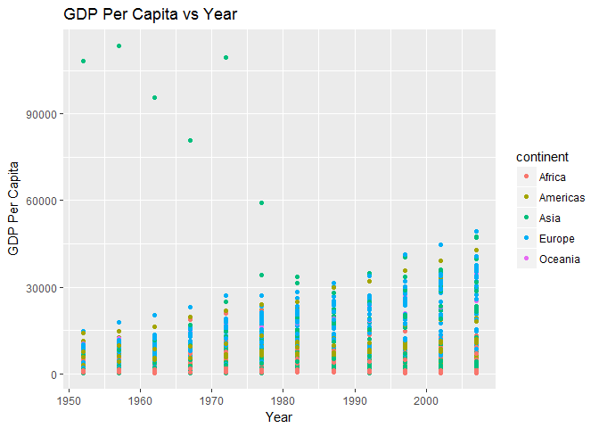
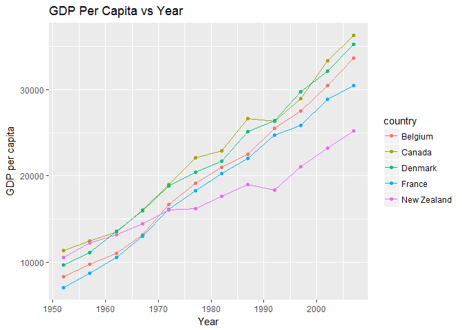
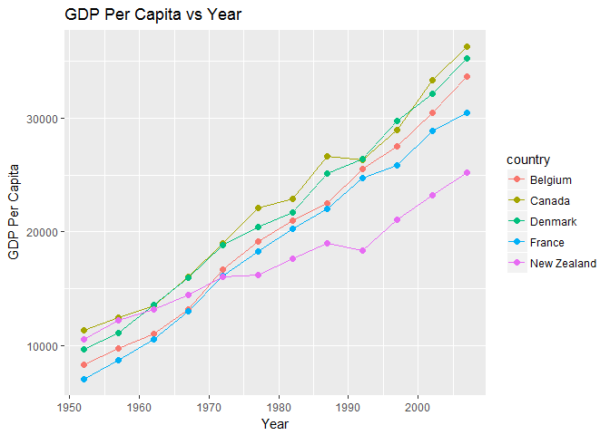
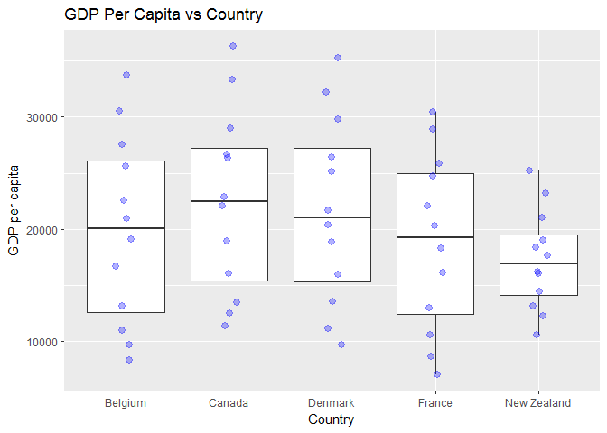
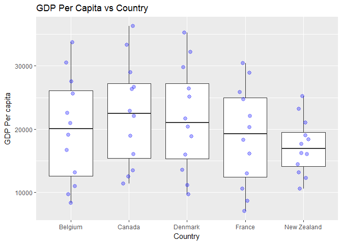
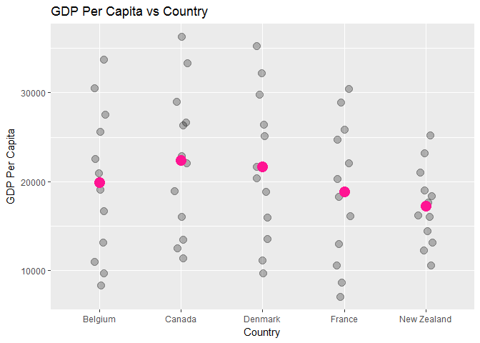
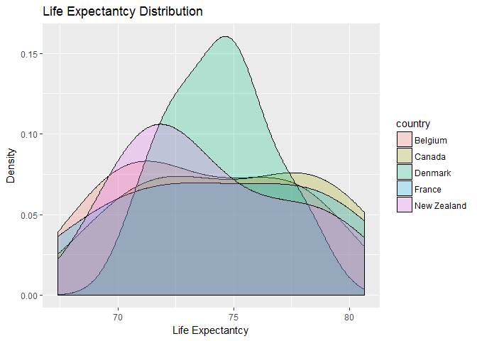

hw02\_HeatherSummers
================

``` r
library(tidyverse)
```

    ## Loading tidyverse: ggplot2
    ## Loading tidyverse: tibble
    ## Loading tidyverse: tidyr
    ## Loading tidyverse: readr
    ## Loading tidyverse: purrr
    ## Loading tidyverse: dplyr

    ## Conflicts with tidy packages ----------------------------------------------

    ## filter(): dplyr, stats
    ## lag():    dplyr, stats

``` r
library(gapminder)
```

Smell test the data
-------------------

#### Is it a data.frame, a matrix, a vector, a list?

``` r
str(gapminder) #Provides a way to display the structure of the gapminder object. 
```

    ## Classes 'tbl_df', 'tbl' and 'data.frame':    1704 obs. of  6 variables:
    ##  $ country  : Factor w/ 142 levels "Afghanistan",..: 1 1 1 1 1 1 1 1 1 1 ...
    ##  $ continent: Factor w/ 5 levels "Africa","Americas",..: 3 3 3 3 3 3 3 3 3 3 ...
    ##  $ year     : int  1952 1957 1962 1967 1972 1977 1982 1987 1992 1997 ...
    ##  $ lifeExp  : num  28.8 30.3 32 34 36.1 ...
    ##  $ pop      : int  8425333 9240934 10267083 11537966 13079460 14880372 12881816 13867957 16317921 22227415 ...
    ##  $ gdpPercap: num  779 821 853 836 740 ...

Gapminder is a data.frame or tibble since it is able to hold different types of variables including character data (i.e. country, continent, etc.) and numeric data (i.e. lifeExp, pop, etc.) while matrices can only use one type of variable (i.e. vectors are of the same mode).

``` r
typeof(gapminder)
```

    ## [1] "list"

In addition, gapminder is a type of list.

#### What's its class?

``` r
class(gapminder)
```

    ## [1] "tbl_df"     "tbl"        "data.frame"

As shown above as well as in 'str(gapminder)', the classes are tibble, table, and data frame.

#### How many variables/columns?

``` r
ncol(gapminder)
```

    ## [1] 6

``` r
names(gapminder) #Provides the names for each of the variables (columns).
```

    ## [1] "country"   "continent" "year"      "lifeExp"   "pop"       "gdpPercap"

There are six variables/columns including country, continent, year, life expectancy, population, and GDP per capita.

#### How many rows/observations?

``` r
nrow(gapminder)
```

    ## [1] 1704

There are 1704 rows in the gapminder data.

#### Can you get these facts about "extent" or "size" in more than one way? Can you imagine different functions being useful in different contexts?

There are several different ways that you can get information regarding the extent or size of the gapminder object. See below for some examples:

``` r
summary(gapminder)
```

    ##         country        continent        year         lifeExp     
    ##  Afghanistan:  12   Africa  :624   Min.   :1952   Min.   :23.60  
    ##  Albania    :  12   Americas:300   1st Qu.:1966   1st Qu.:48.20  
    ##  Algeria    :  12   Asia    :396   Median :1980   Median :60.71  
    ##  Angola     :  12   Europe  :360   Mean   :1980   Mean   :59.47  
    ##  Argentina  :  12   Oceania : 24   3rd Qu.:1993   3rd Qu.:70.85  
    ##  Australia  :  12                  Max.   :2007   Max.   :82.60  
    ##  (Other)    :1632                                                
    ##       pop              gdpPercap       
    ##  Min.   :6.001e+04   Min.   :   241.2  
    ##  1st Qu.:2.794e+06   1st Qu.:  1202.1  
    ##  Median :7.024e+06   Median :  3531.8  
    ##  Mean   :2.960e+07   Mean   :  7215.3  
    ##  3rd Qu.:1.959e+07   3rd Qu.:  9325.5  
    ##  Max.   :1.319e+09   Max.   :113523.1  
    ## 

The function 'summary()' is a good way to get a statistical overview of the data (i.e. min, max, median, mean, etc.).

``` r
dim(gapminder)
```

    ## [1] 1704    6

The function 'dim(gapminder)' provides the dimensions of the data frame, thus the number of rows and columns.

``` r
length(gapminder)
```

    ## [1] 6

The function 'length(gapminder)' provides the number of elements in a list and with the gapminder data frame each column is a list so therefore the output provides the number of columns.

The functions 'dim()' and 'length()' provide a quick way of getting basic information on the size and extent of the data.

There are also occasions where it may be useful to get more specific information such as the number of observations per continent.

``` r
gapminder %>%
  group_by(continent) %>%
  summarize (n = n())
```

    ## # A tibble: 5 x 2
    ##   continent     n
    ##      <fctr> <int>
    ## 1    Africa   624
    ## 2  Americas   300
    ## 3      Asia   396
    ## 4    Europe   360
    ## 5   Oceania    24

You can also get the number of unique countries for each continent.

``` r
gapminder %>%
  group_by(continent) %>%
  summarize(n = n(),
            n_countries = n_distinct(country))
```

    ## # A tibble: 5 x 3
    ##   continent     n n_countries
    ##      <fctr> <int>       <int>
    ## 1    Africa   624          52
    ## 2  Americas   300          25
    ## 3      Asia   396          33
    ## 4    Europe   360          30
    ## 5   Oceania    24           2

#### What data type is each variable?

``` r
lapply(gapminder, class) #In order to get the classes of each of the columns in the data frame.
```

    ## $country
    ## [1] "factor"
    ## 
    ## $continent
    ## [1] "factor"
    ## 
    ## $year
    ## [1] "integer"
    ## 
    ## $lifeExp
    ## [1] "numeric"
    ## 
    ## $pop
    ## [1] "integer"
    ## 
    ## $gdpPercap
    ## [1] "numeric"

``` r
str(gapminder) #Also provides a way to get the data type for each variable.
```

    ## Classes 'tbl_df', 'tbl' and 'data.frame':    1704 obs. of  6 variables:
    ##  $ country  : Factor w/ 142 levels "Afghanistan",..: 1 1 1 1 1 1 1 1 1 1 ...
    ##  $ continent: Factor w/ 5 levels "Africa","Americas",..: 3 3 3 3 3 3 3 3 3 3 ...
    ##  $ year     : int  1952 1957 1962 1967 1972 1977 1982 1987 1992 1997 ...
    ##  $ lifeExp  : num  28.8 30.3 32 34 36.1 ...
    ##  $ pop      : int  8425333 9240934 10267083 11537966 13079460 14880372 12881816 13867957 16317921 22227415 ...
    ##  $ gdpPercap: num  779 821 853 836 740 ...

The country and continent variables are factors, year and population are integers, and life expectancy and GDP per capita are numeric.

Explore individual variables
----------------------------

The categorical variables I have chosen to explore are continents and countries and the quantitative variables I have chosen to explore are life expectancy and GDP per capita.

#### What are possible values (or range, whichever is appropriate) of each variable?

``` r
summary(gapminder$continent) %>%
  length()
```

    ## [1] 5

``` r
summary(gapminder$continent)
```

    ##   Africa Americas     Asia   Europe  Oceania 
    ##      624      300      396      360       24

``` r
table(gapminder$continent)
```

    ## 
    ##   Africa Americas     Asia   Europe  Oceania 
    ##      624      300      396      360       24

The first function lets us know that there are five continents listed in the gapminder data frame and the last two functions both provide the number of elements for each of the continents.

For the 'country' variable there are 142 countries listed in the gapminder dataset.

``` r
unique(gapminder$country) %>%
  length()
```

    ## [1] 142

Below are the first five countries listed in alphabetical order.

``` r
unique(select(gapminder, country)) %>%
  head()
```

    ## # A tibble: 6 x 1
    ##       country
    ##        <fctr>
    ## 1 Afghanistan
    ## 2     Albania
    ## 3     Algeria
    ## 4      Angola
    ## 5   Argentina
    ## 6   Australia

Now looking at the quantitative variables, life expectantcy and GDP percapita.

To get the range of life expectantcy and GDP per capita you can use the functions 'range()' or 'summary()'.

``` r
range(gapminder$lifeExp)
```

    ## [1] 23.599 82.603

``` r
summary(gapminder$lifeExp)
```

    ##    Min. 1st Qu.  Median    Mean 3rd Qu.    Max. 
    ##   23.60   48.20   60.71   59.47   70.85   82.60

The life expectantcy data ranges from 23.60 to 82.60.

``` r
range(gapminder$gdpPercap)
```

    ## [1]    241.1659 113523.1329

``` r
summary(gapminder$gdpPercap)
```

    ##     Min.  1st Qu.   Median     Mean  3rd Qu.     Max. 
    ##    241.2   1202.1   3531.8   7215.3   9325.5 113523.1

The GDP per capita data ranges from 241.2 to 113523.1.

You can also get the range of GDP per capita by continent.

``` r
gapminder %>%
  group_by(continent) %>%
  summarize(minGDP=min(gdpPercap), maxGDP=max(gdpPercap))
```

    ## # A tibble: 5 x 3
    ##   continent     minGDP    maxGDP
    ##      <fctr>      <dbl>     <dbl>
    ## 1    Africa   241.1659  21951.21
    ## 2  Americas  1201.6372  42951.65
    ## 3      Asia   331.0000 113523.13
    ## 4    Europe   973.5332  49357.19
    ## 5   Oceania 10039.5956  34435.37

#### What values are typical? What's the spread? What's the distribution?

To get the distribution of the observations based on continent I used the function 'barplot()'.

``` r
barplot(table(gapminder$continent))
```


Based on this graph there are more observations for Africa, followed by Asia, Europe, Americas, and then Oceania. Continents display a slightly skewed right distribution.

A historgram can be used to illustrate the distribution for life expectantcy and GDP per capita.

``` r
hist(gapminder$lifeExp)
```


``` r
hist(gapminder$gdpPercap)
```


Life expectantcy displays a skewed left distribution while GDP per capita displays a skewed right distribution.

Explore various plot types
--------------------------

The GDP per capita per year for each continent.

``` r
gapminder %>%
  group_by(continent,year) %>%
  ggplot(aes(x = year, y = gdpPercap)) +
  geom_point(aes(colour = continent)) +
  labs(title = "GDP Per Capita vs Year", x = "Year", y = "GDP per capita")
```



Now to focus on the GDP per capita of five countries.

``` r
gapminder %>%
    filter(country %in% c("Canada", "New Zealand","France", "Belgium", "Denmark")) %>% 
             ggplot(aes(x = year, y = gdpPercap, colour = country)) + 
                   geom_line() + geom_point() +
  labs(title = "GDP Per Capita vs Year", x = "Year", y = "GDP per capita")
```

 The same graph can also be created the following way.

``` r
fiveCountries <- c("Canada", "New Zealand","France", "Belgium", "Denmark")
x<-droplevels(subset(gapminder, country %in% fiveCountries))
ggplot(x, aes(x = year, y = gdpPercap, colour = country)) + geom_line() + geom_point() + labs(title = "GDP Per Capita vs Year", x = "Year", y = "GDP per capita")
```



A boxplot of the GDP per capita of five countries.

``` r
gapminder %>%
    filter(country %in% c("Canada", "New Zealand","France", "Belgium", "Denmark")) %>% 
             ggplot(aes(x = country, y = gdpPercap)) + geom_boxplot() + labs(title = "GDP Per Capita vs Country", x = "Country", y = "GDP per capita" )
```



You can also add the raw data points (seen in blue) onto the boxplot.

``` r
gapminder %>%
    filter(country %in% c("Canada", "New Zealand","France", "Belgium", "Denmark")) %>% 
             ggplot(aes(x = country, y = gdpPercap)) + geom_boxplot() + 
  geom_jitter(position = position_jitter(width = 0.1, height = 0), alpha = 0.3, size = 2.5, colour = "blue") +
  labs(title = "GDP Per Capita vs Country", x = "Country", y = "GDP per capita" )
```



You can also just have a stripplot (univariate scatterplot) in which only the raw data points are plotted.

``` r
gapminder %>%
    filter(country %in% c("Canada", "New Zealand","France", "Belgium", "Denmark")) %>% 
             ggplot(aes(x = country, y = gdpPercap)) + 
  geom_jitter(position = position_jitter(width = 0.1, height = 0), alpha = 0.3, size = 3.5, colour = "grey10") + 
  stat_summary(fun.y = mean, colour = "deeppink", geom = "point", size = 5) + 
  labs(title = "GDP Per Capita vs Country", x = "Country", y = "GDP per capita" )
```

 The mean GDP per capita for each country is shown by the pink point on the plot.

Now to create a density plot of the life expectantcies of the five countries.

``` r
gapminder %>%
    filter(country %in% c("Canada", "New Zealand","France", "Belgium", "Denmark")) %>% 
  ggplot(aes(x = lifeExp, fill = country)) +
  geom_density (alpha = 0.25) +
  labs (title = "Life Expectantcy Distribution", x = "Life Expectantcy", y = "Density")
```



To plot GDP per capita and life expectantcy for each continent in the year 1997 I used the function 'facet\_wrap()'.

``` r
jPch <- 21
jDarkGray <- 'grey15'
jXlim <- c(150, 114500)
jYlim <- c(25, 100)

ggplot(subset(gapminder, year == 1997),
       aes(x = gdpPercap, y = lifeExp)) +
  scale_x_log10(limits = jXlim) + ylim(jYlim) +
  geom_point(aes(size = sqrt(pop)), pch = jPch, colour = jDarkGray, show.legend = FALSE, alpha = 0.5) +
  scale_size_continuous(range=c(1,40)) + facet_wrap(~ continent) + coord_fixed(ratio = 1/43) + aes(fill = country) + scale_fill_manual(values = country_colors) + theme_bw() + theme(strip.text = element_text(size = rel(1.1))) + labs(title = "Life Expectancy vs GDP per capita in 1997", 
      x = "GDP per capita", y = "Life Expectancy")
```



``` r
#The gapminder package comes with colour schemes for countries and continents, use the function 'country_colours'.
```

But I want to do more!
----------------------

``` r
filter(gapminder, country == c("Rwanda", "Afghanistan"))
```

    ## # A tibble: 12 x 6
    ##        country continent  year lifeExp      pop gdpPercap
    ##         <fctr>    <fctr> <int>   <dbl>    <int>     <dbl>
    ##  1 Afghanistan      Asia  1957  30.332  9240934  820.8530
    ##  2 Afghanistan      Asia  1967  34.020 11537966  836.1971
    ##  3 Afghanistan      Asia  1977  38.438 14880372  786.1134
    ##  4 Afghanistan      Asia  1987  40.822 13867957  852.3959
    ##  5 Afghanistan      Asia  1997  41.763 22227415  635.3414
    ##  6 Afghanistan      Asia  2007  43.828 31889923  974.5803
    ##  7      Rwanda    Africa  1952  40.000  2534927  493.3239
    ##  8      Rwanda    Africa  1962  43.000  3051242  597.4731
    ##  9      Rwanda    Africa  1972  44.600  3992121  590.5807
    ## 10      Rwanda    Africa  1982  46.218  5507565  881.5706
    ## 11      Rwanda    Africa  1992  23.599  7290203  737.0686
    ## 12      Rwanda    Africa  2002  43.413  7852401  785.6538

The output above is missing some of the data for both countries. Below is the correct way to get the data for Rwanda and Afghanistan.

``` r
library(knitr)
gapminder %>%
    filter(country %in% c("Rwanda", "Afghanistan")) %>% 
  kable(digits = 1, align = 'c')
```

|   country   | continent | year | lifeExp |    pop   | gdpPercap |
|:-----------:|:---------:|:----:|:-------:|:--------:|:---------:|
| Afghanistan |    Asia   | 1952 |   28.8  |  8425333 |   779.4   |
| Afghanistan |    Asia   | 1957 |   30.3  |  9240934 |   820.9   |
| Afghanistan |    Asia   | 1962 |   32.0  | 10267083 |   853.1   |
| Afghanistan |    Asia   | 1967 |   34.0  | 11537966 |   836.2   |
| Afghanistan |    Asia   | 1972 |   36.1  | 13079460 |   740.0   |
| Afghanistan |    Asia   | 1977 |   38.4  | 14880372 |   786.1   |
| Afghanistan |    Asia   | 1982 |   39.9  | 12881816 |   978.0   |
| Afghanistan |    Asia   | 1987 |   40.8  | 13867957 |   852.4   |
| Afghanistan |    Asia   | 1992 |   41.7  | 16317921 |   649.3   |
| Afghanistan |    Asia   | 1997 |   41.8  | 22227415 |   635.3   |
| Afghanistan |    Asia   | 2002 |   42.1  | 25268405 |   726.7   |
| Afghanistan |    Asia   | 2007 |   43.8  | 31889923 |   974.6   |
|    Rwanda   |   Africa  | 1952 |   40.0  |  2534927 |   493.3   |
|    Rwanda   |   Africa  | 1957 |   41.5  |  2822082 |   540.3   |
|    Rwanda   |   Africa  | 1962 |   43.0  |  3051242 |   597.5   |
|    Rwanda   |   Africa  | 1967 |   44.1  |  3451079 |   511.0   |
|    Rwanda   |   Africa  | 1972 |   44.6  |  3992121 |   590.6   |
|    Rwanda   |   Africa  | 1977 |   45.0  |  4657072 |   670.1   |
|    Rwanda   |   Africa  | 1982 |   46.2  |  5507565 |   881.6   |
|    Rwanda   |   Africa  | 1987 |   44.0  |  6349365 |   848.0   |
|    Rwanda   |   Africa  | 1992 |   23.6  |  7290203 |   737.1   |
|    Rwanda   |   Africa  | 1997 |   36.1  |  7212583 |   589.9   |
|    Rwanda   |   Africa  | 2002 |   43.4  |  7852401 |   785.7   |
|    Rwanda   |   Africa  | 2007 |   46.2  |  8860588 |   863.1   |
