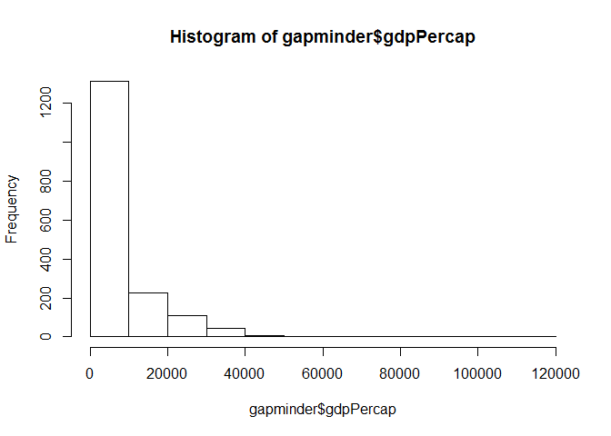

hw02\_HeatherSummers
================

``` r
library(tidyverse)
```

    ## Loading tidyverse: ggplot2
    ## Loading tidyverse: tibble
    ## Loading tidyverse: tidyr
    ## Loading tidyverse: readr
    ## Loading tidyverse: purrr
    ## Loading tidyverse: dplyr

    ## Conflicts with tidy packages ----------------------------------------------

    ## filter(): dplyr, stats
    ## lag():    dplyr, stats

``` r
library(gapminder)
```

Smell test the data
-------------------

#### Is it a data.frame, a matrix, a vector, a list?

``` r
str(gapminder) #Provides a way to display the structure of the gapminder object. 
```

    ## Classes 'tbl_df', 'tbl' and 'data.frame':    1704 obs. of  6 variables:
    ##  $ country  : Factor w/ 142 levels "Afghanistan",..: 1 1 1 1 1 1 1 1 1 1 ...
    ##  $ continent: Factor w/ 5 levels "Africa","Americas",..: 3 3 3 3 3 3 3 3 3 3 ...
    ##  $ year     : int  1952 1957 1962 1967 1972 1977 1982 1987 1992 1997 ...
    ##  $ lifeExp  : num  28.8 30.3 32 34 36.1 ...
    ##  $ pop      : int  8425333 9240934 10267083 11537966 13079460 14880372 12881816 13867957 16317921 22227415 ...
    ##  $ gdpPercap: num  779 821 853 836 740 ...

Gapminder is a data.frame or tibble since it is able to hold different types of variables including character data (i.e. country, continent, etc.) and numeric data (i.e. lifeExp, pop, etc.) while matrices can only use one type of variable (i.e. vectors are of the same mode).

``` r
typeof(gapminder)
```

    ## [1] "list"

In addition, gapminder is a type of list.

#### What's its class?

``` r
class(gapminder)
```

    ## [1] "tbl_df"     "tbl"        "data.frame"

As shown above as well as in 'str(gapminder)', the classes are tibble, table, and data frame.

#### How many variables/columns?

``` r
ncol(gapminder)
```

    ## [1] 6

``` r
names(gapminder) #Provides the names for each of the variables (columns).
```

    ## [1] "country"   "continent" "year"      "lifeExp"   "pop"       "gdpPercap"

There are six variables/columns including country, continent, year, life expectancy, population, and GDP per capita.

#### How many rows/observations?

``` r
nrow(gapminder)
```

    ## [1] 1704

There are 1704 rows in the gapminder data.

#### Can you get these facts about "extent" or "size" in more than one way? Can you imagine different functions being useful in different contexts?

There are several different ways that you can get information regarding the extent or size of the gapminder object. See below for some examples:

``` r
summary(gapminder)
```

    ##         country        continent        year         lifeExp     
    ##  Afghanistan:  12   Africa  :624   Min.   :1952   Min.   :23.60  
    ##  Albania    :  12   Americas:300   1st Qu.:1966   1st Qu.:48.20  
    ##  Algeria    :  12   Asia    :396   Median :1980   Median :60.71  
    ##  Angola     :  12   Europe  :360   Mean   :1980   Mean   :59.47  
    ##  Argentina  :  12   Oceania : 24   3rd Qu.:1993   3rd Qu.:70.85  
    ##  Australia  :  12                  Max.   :2007   Max.   :82.60  
    ##  (Other)    :1632                                                
    ##       pop              gdpPercap       
    ##  Min.   :6.001e+04   Min.   :   241.2  
    ##  1st Qu.:2.794e+06   1st Qu.:  1202.1  
    ##  Median :7.024e+06   Median :  3531.8  
    ##  Mean   :2.960e+07   Mean   :  7215.3  
    ##  3rd Qu.:1.959e+07   3rd Qu.:  9325.5  
    ##  Max.   :1.319e+09   Max.   :113523.1  
    ## 

``` r
dim(gapminder) #Provides the dimensions of the data frame (i.e. number of rows and columns).
```

    ## [1] 1704    6

``` r
length(gapminder) #Provides the number of elements in a list columns.
```

    ## [1] 6

The function 'summary()' is a good way to get a statistical overview of the data (i.e. min, max, median, mean, etc.).

``` r
dim(gapminder)
```

    ## [1] 1704    6

The function 'dim(gapminder)' provides the dimensions of the data frame, thus the number of rows and columns.

``` r
length(gapminder)
```

    ## [1] 6

The function 'length(gapminder)' provides the number of elements in a list and with the gapminder data frame each column is a list so therefore the output provides the number of columns.

The functions 'dim()' and 'length()' provide a quick way of getting basic information on the size and extent of the data.

#### What data type is each variable?

``` r
lapply(gapminder, class) #In order to get the classes of each of the columns in the data frame.
```

    ## $country
    ## [1] "factor"
    ## 
    ## $continent
    ## [1] "factor"
    ## 
    ## $year
    ## [1] "integer"
    ## 
    ## $lifeExp
    ## [1] "numeric"
    ## 
    ## $pop
    ## [1] "integer"
    ## 
    ## $gdpPercap
    ## [1] "numeric"

``` r
str(gapminder) #Also provides a way to get the data type for each variable.
```

    ## Classes 'tbl_df', 'tbl' and 'data.frame':    1704 obs. of  6 variables:
    ##  $ country  : Factor w/ 142 levels "Afghanistan",..: 1 1 1 1 1 1 1 1 1 1 ...
    ##  $ continent: Factor w/ 5 levels "Africa","Americas",..: 3 3 3 3 3 3 3 3 3 3 ...
    ##  $ year     : int  1952 1957 1962 1967 1972 1977 1982 1987 1992 1997 ...
    ##  $ lifeExp  : num  28.8 30.3 32 34 36.1 ...
    ##  $ pop      : int  8425333 9240934 10267083 11537966 13079460 14880372 12881816 13867957 16317921 22227415 ...
    ##  $ gdpPercap: num  779 821 853 836 740 ...

The country and continent variables are factors, year and population are integers, and life expectancy and GDP per capita are numeric.

Explore individual variables
----------------------------

The categorical variables I have chosen to explore are continents and countries and the quantitative variables I have chosen to explore are life expectancy and GDP per capita.

#### What are possible values (or range, whichever is appropriate) of each variable?

``` r
summary(gapminder$continent) %>%
  length()
```

    ## [1] 5

``` r
summary(gapminder$continent)
```

    ##   Africa Americas     Asia   Europe  Oceania 
    ##      624      300      396      360       24

``` r
table(gapminder$continent)
```

    ## 
    ##   Africa Americas     Asia   Europe  Oceania 
    ##      624      300      396      360       24

These two functions let us know that there are five continents listed in the gapminder data frame and provides the number of elements for each of the continents. The function 'table(gapminder$continent)' provides the same information.

``` r
unique(select(gapminder, country)) %>%
  head(15)
```

    ## # A tibble: 15 x 1
    ##                   country
    ##                    <fctr>
    ##  1            Afghanistan
    ##  2                Albania
    ##  3                Algeria
    ##  4                 Angola
    ##  5              Argentina
    ##  6              Australia
    ##  7                Austria
    ##  8                Bahrain
    ##  9             Bangladesh
    ## 10                Belgium
    ## 11                  Benin
    ## 12                Bolivia
    ## 13 Bosnia and Herzegovina
    ## 14               Botswana
    ## 15                 Brazil

``` r
barplot(table(gapminder$continent))
```


``` r
summary(gapminder$country) %>%
  length()
```

    ## [1] 100

``` r
summary(gapminder$lifeExp)
```

    ##    Min. 1st Qu.  Median    Mean 3rd Qu.    Max. 
    ##   23.60   48.20   60.71   59.47   70.85   82.60

``` r
hist(gapminder$lifeExp)
```


``` r
summary(gapminder$gdpPercap)
```

    ##     Min.  1st Qu.   Median     Mean  3rd Qu.     Max. 
    ##    241.2   1202.1   3531.8   7215.3   9325.5 113523.1

``` r
hist(gapminder$gdpPercap)
```


