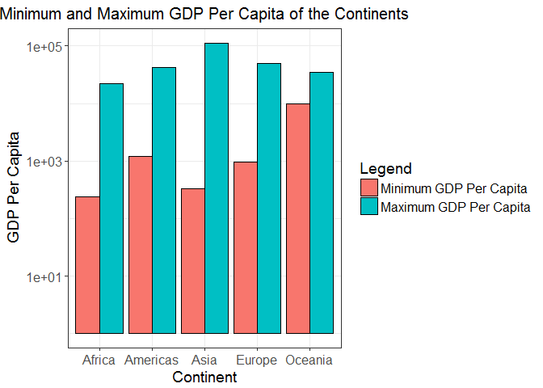
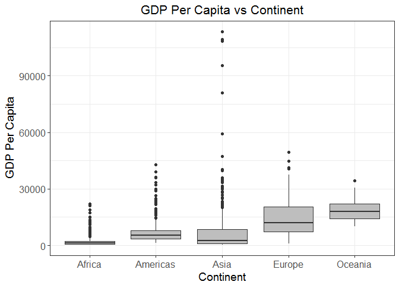
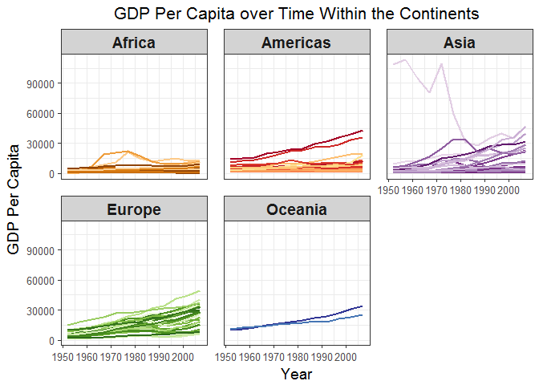
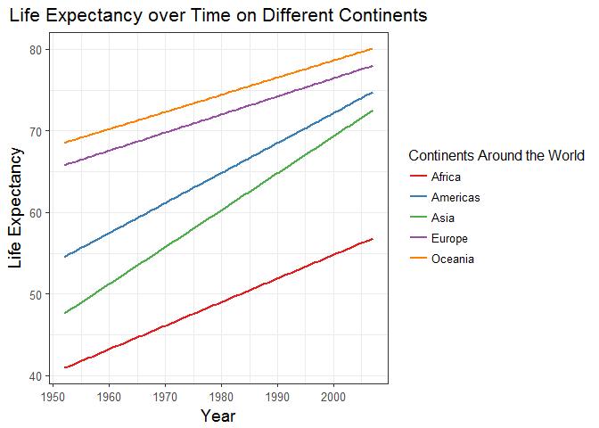
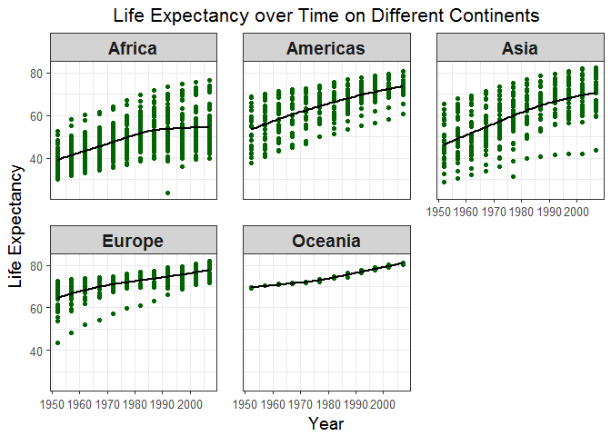
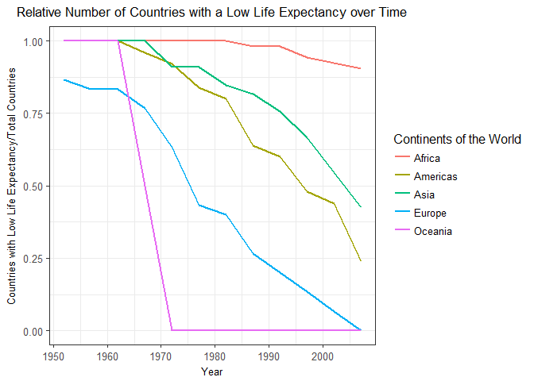

hw03
================

Below is STAT545 Homework 03.

First, load the 'gapminder' dataset and the 'tidyverse' package. Next, load 'knitr' as it can be used to make decent-looking table output, 'reshape2' as it can be used to change the format of data (i.e. change to long- or wide-format), and 'RcolorBrewer' as it can be used to create nice looking colour palettes.

``` r
library(gapminder)
library(tidyverse)
library(knitr)
library(RColorBrewer)
library(reshape2)
```

Get the maximum and minimum of GDP per capita for all continents.
-----------------------------------------------------------------

First group the data set by continent and then use the function 'summarize' to get the minimum and maximum GDP per capita for each continent.

``` r
p1<- group_by(gapminder, continent) %>%
  summarize(min_gdppercap=min(gdpPercap),max_gdppercap=max(gdpPercap)) 
knitr::kable(p1, digits =2, align = 'c')
```

| continent | min\_gdppercap | max\_gdppercap |
|:---------:|:--------------:|:--------------:|
|   Africa  |     241.17     |    21951.21    |
|  Americas |     1201.64    |    42951.65    |
|    Asia   |     331.00     |    113523.13   |
|   Europe  |     973.53     |    49357.19    |
|  Oceania  |    10039.60    |    34435.37    |

Using the format from the table above I was unable to create a ggplot in which both the minimum and maximum GDP per capita are side-by-side for each continent. As such I used the function 'melt()' from the package 'reshape2' to create one column with both the minimum and maximum GDP per capita for each continent.

``` r
p2 <- melt(p1,id.vars = c("continent"))
knitr::kable(p2)
```

| continent | variable       |        value|
|:----------|:---------------|------------:|
| Africa    | min\_gdppercap |     241.1659|
| Americas  | min\_gdppercap |    1201.6372|
| Asia      | min\_gdppercap |     331.0000|
| Europe    | min\_gdppercap |     973.5332|
| Oceania   | min\_gdppercap |   10039.5956|
| Africa    | max\_gdppercap |   21951.2118|
| Americas  | max\_gdppercap |   42951.6531|
| Asia      | max\_gdppercap |  113523.1329|
| Europe    | max\_gdppercap |   49357.1902|
| Oceania   | max\_gdppercap |   34435.3674|

Next, I created a barplot where the bars for both the minimum and maximum GDP per capita for each continent were next to one another on the graph.

``` r
ggplot(p2, aes(x = continent, y = value, fill = variable)) +
  geom_bar(stat='identity', position='dodge', colour='black') + #specify the 'dodge' position to get the bars beside each other and not stacked
  scale_fill_discrete("Legend", labels = c("Minimum GDP Per Capita", "Maximum GDP Per Capita")) +
  scale_y_log10() + #added a log scale to y axis since the difference between the two variables was so drastic that the minimum GDP per capita for some continents was barely represented on the figure
  theme_bw()+
  theme(axis.title = element_text(size=14),
        axis.text.x = element_text(size=12),
        axis.text.y = element_text(size=12),
        plot.title = element_text(size=15, hjust = 0.5),
        legend.title = element_text(size=14),
        legend.text = element_text(size=12)) +
  labs(x = "Continent", y = "GDP Per Capita", title = "Minimum and Maximum GDP Per Capita of the Continents")
```



Looking at this figure you can see that Africa has the lowest minimum GDP per capita while Asia has the highest maximum GDP per capita.

Look at the spread of GDP per capita within the continents.
-----------------------------------------------------------

First, group the data by continent and year. Next, in order to understand the spread of the data generate the minimum, maximum, average, median, and standard deviation of GDP per capita for each continent by year.

``` r
p3 <- group_by(gapminder, continent, year) %>% 
  summarize (min_gdppercap=min(gdpPercap),
             max_gdppercap=max(gdpPercap), 
             average_gdppercap = mean(gdpPercap),
             median_gdppercap = median(gdpPercap),
             standarddev_gdppercap = sd(gdpPercap)) %>% 
  rename("Continent" = continent, "Year" = year, "Minimum GDP Per Capita" = min_gdppercap, "Maximum GDP Per Capita" = max_gdppercap, "Average" = average_gdppercap, "Median" = median_gdppercap, "Standard Deviation" = standarddev_gdppercap)
knitr::kable(p3, digits = 2, align = 'c')
```

| Continent | Year | Minimum GDP Per Capita | Maximum GDP Per Capita |  Average |  Median  | Standard Deviation |
|:---------:|:----:|:----------------------:|:----------------------:|:--------:|:--------:|:------------------:|
|   Africa  | 1952 |         298.85         |         4725.30        |  1252.57 |  987.03  |       982.95       |
|   Africa  | 1957 |         336.00         |         5487.10        |  1385.24 |  1024.02 |       1134.51      |
|   Africa  | 1962 |         355.20         |         6757.03        |  1598.08 |  1133.78 |       1461.84      |
|   Africa  | 1967 |         412.98         |        18772.75        |  2050.36 |  1210.38 |       2847.72      |
|   Africa  | 1972 |         464.10         |        21011.50        |  2339.62 |  1443.37 |       3286.85      |
|   Africa  | 1977 |         502.32         |        21951.21        |  2585.94 |  1399.64 |       4142.40      |
|   Africa  | 1982 |         462.21         |        17364.28        |  2481.59 |  1323.73 |       3242.63      |
|   Africa  | 1987 |         389.88         |        11864.41        |  2282.67 |  1219.59 |       2566.53      |
|   Africa  | 1992 |         410.90         |        13522.16        |  2281.81 |  1161.63 |       2644.08      |
|   Africa  | 1997 |         312.19         |        14722.84        |  2378.76 |  1179.88 |       2820.73      |
|   Africa  | 2002 |         241.17         |        12521.71        |  2599.39 |  1215.68 |       2972.65      |
|   Africa  | 2007 |         277.55         |        13206.48        |  3089.03 |  1452.27 |       3618.16      |
|  Americas | 1952 |         1397.72        |        13990.48        |  4079.06 |  3048.30 |       3001.73      |
|  Americas | 1957 |         1544.40        |        14847.13        |  4616.04 |  3780.55 |       3312.38      |
|  Americas | 1962 |         1662.14        |        16173.15        |  4901.54 |  4086.11 |       3421.74      |
|  Americas | 1967 |         1452.06        |        19530.37        |  5668.25 |  4643.39 |       4160.89      |
|  Americas | 1972 |         1654.46        |        21806.04        |  6491.33 |  5305.45 |       4754.40      |
|  Americas | 1977 |         1874.30        |        24072.63        |  7352.01 |  6281.29 |       5355.60      |
|  Americas | 1982 |         2011.16        |        25009.56        |  7506.74 |  6434.50 |       5530.49      |
|  Americas | 1987 |         1823.02        |        29884.35        |  7793.40 |  6360.94 |       6665.04      |
|  Americas | 1992 |         1456.31        |        32003.93        |  8044.93 |  6618.74 |       7047.09      |
|  Americas | 1997 |         1341.73        |        35767.43        |  8889.30 |  7113.69 |       7874.23      |
|  Americas | 2002 |         1270.36        |        39097.10        |  9287.68 |  6994.77 |       8895.82      |
|  Americas | 2007 |         1201.64        |        42951.65        | 11003.03 |  8948.10 |       9713.21      |
|    Asia   | 1952 |         331.00         |        108382.35       |  5195.48 |  1206.95 |      18634.89      |
|    Asia   | 1957 |         350.00         |        113523.13       |  5787.73 |  1547.94 |      19506.52      |
|    Asia   | 1962 |         388.00         |        95458.11        |  5729.37 |  1649.55 |      16415.86      |
|    Asia   | 1967 |         349.00         |        80894.88        |  5971.17 |  2029.23 |      14062.59      |
|    Asia   | 1972 |         357.00         |        109347.87       |  8187.47 |  2571.42 |      19087.50      |
|    Asia   | 1977 |         371.00         |        59265.48        |  7791.31 |  3195.48 |      11815.78      |
|    Asia   | 1982 |         424.00         |        33693.18        |  7434.14 |  4106.53 |       8701.18      |
|    Asia   | 1987 |         385.00         |        28118.43        |  7608.23 |  4106.49 |       8090.26      |
|    Asia   | 1992 |         347.00         |        34932.92        |  8639.69 |  3726.06 |       9727.43      |
|    Asia   | 1997 |         415.00         |        40300.62        |  9834.09 |  3645.38 |      11094.18      |
|    Asia   | 2002 |         611.00         |        36023.11        | 10174.09 |  4090.93 |      11150.72      |
|    Asia   | 2007 |         944.00         |        47306.99        | 12473.03 |  4471.06 |      14154.94      |
|   Europe  | 1952 |         973.53         |        14734.23        |  5661.06 |  5142.47 |       3114.06      |
|   Europe  | 1957 |         1353.99        |        17909.49        |  6963.01 |  6066.72 |       3677.95      |
|   Europe  | 1962 |         1709.68        |        20431.09        |  8365.49 |  7515.73 |       4199.19      |
|   Europe  | 1967 |         2172.35        |        22966.14        | 10143.82 |  9366.07 |       4724.98      |
|   Europe  | 1972 |         2860.17        |        27195.11        | 12479.58 | 12326.38 |       5509.69      |
|   Europe  | 1977 |         3528.48        |        26982.29        | 14283.98 | 14225.75 |       5874.46      |
|   Europe  | 1982 |         3630.88        |        28397.72        | 15617.90 | 15322.82 |       6453.23      |
|   Europe  | 1987 |         3738.93        |        31540.97        | 17214.31 | 16215.49 |       7482.96      |
|   Europe  | 1992 |         2497.44        |        33965.66        | 17061.57 | 17550.16 |       9109.80      |
|   Europe  | 1997 |         3193.05        |        41283.16        | 19076.78 | 19596.50 |      10065.46      |
|   Europe  | 2002 |         4604.21        |        44683.98        | 21711.73 | 23674.86 |      11197.36      |
|   Europe  | 2007 |         5937.03        |        49357.19        | 25054.48 | 28054.07 |      11800.34      |
|  Oceania  | 1952 |        10039.60        |        10556.58        | 10298.09 | 10298.09 |       365.56       |
|  Oceania  | 1957 |        10949.65        |        12247.40        | 11598.52 | 11598.52 |       917.64       |
|  Oceania  | 1962 |        12217.23        |        13175.68        | 12696.45 | 12696.45 |       677.73       |
|  Oceania  | 1967 |        14463.92        |        14526.12        | 14495.02 | 14495.02 |        43.99       |
|  Oceania  | 1972 |        16046.04        |        16788.63        | 16417.33 | 16417.33 |       525.09       |
|  Oceania  | 1977 |        16233.72        |        18334.20        | 17283.96 | 17283.96 |       1485.26      |
|  Oceania  | 1982 |        17632.41        |        19477.01        | 18554.71 | 18554.71 |       1304.33      |
|  Oceania  | 1987 |        19007.19        |        21888.89        | 20448.04 | 20448.04 |       2037.67      |
|  Oceania  | 1992 |        18363.32        |        23424.77        | 20894.05 | 20894.05 |       3578.98      |
|  Oceania  | 1997 |        21050.41        |        26997.94        | 24024.18 | 24024.18 |       4205.53      |
|  Oceania  | 2002 |        23189.80        |        30687.75        | 26938.78 | 26938.78 |       5301.85      |
|  Oceania  | 2007 |        25185.01        |        34435.37        | 29810.19 | 29810.19 |       6540.99      |

Then plot the data in order to see the spread of GDP per capita within each continent.

``` r
gapminder %>% 
  ggplot(aes(x = continent, y = gdpPercap)) +
  geom_boxplot(fill = "grey") +
  labs(title = "GDP Per Capita vs Continent", x = "Continent", y = "GDP Per Capita") +
  theme_bw() +
  theme(axis.title = element_text(size=14),
        axis.text.x = element_text(size=12),
        axis.text.y = element_text(size=12),
        plot.title = element_text(size=16, hjust = 0.5))
```



This boxplot provides a way to visualize the minimum, maximum, and average GDP per capita within each continent as well as outliers, however, the boxplots generated for each continent are squished at the bottom of the figure (due to the outliers).

Another way to plot the data is to create a spaghetti plot since it gives a sense of the distribution of trends within each continent by year.

``` r
ggplot(gapminder, aes(x = year, y = gdpPercap, group = country)) +
  geom_line(lwd = 1, show.legend = FALSE) +
  facet_wrap(~continent) +
  aes(colour=country) +
  scale_colour_manual(values = country_colors) +
  scale_y_continuous("GDP Per Capita", position="left") +
  labs(x="Year", title="GDP Per Capita over Time Within the Continents") +
  theme_bw(base_size=12) +
  theme(strip.background = element_rect(fill="lightgrey"),
        axis.title = element_text(size=14),
        strip.text = element_text(size=14, face="bold"),
        plot.title = element_text(size=16, hjust = 0.5), #'hjust' centers the title
        panel.spacing = unit(1.1, "lines")) #increase spacing between graphs
```



I am interested to find out which country in Asia had such a high GDP per capita between 1950 and 1980.

``` r
gapminder %>% 
  filter (continent == "Asia", year <= 1979, year >= 1949) %>% 
  filter (gdpPercap == max(gdpPercap)) %>%
  select (continent, country, year, gdpPercap)
```

    ## # A tibble: 1 x 4
    ##   continent country  year gdpPercap
    ##      <fctr>  <fctr> <int>     <dbl>
    ## 1      Asia  Kuwait  1957  113523.1

From this output I have determined that Kuwait had the highest GDP per capita in Asia between 1950 and 1980 with a maximum GDP per capita of 113 523.1 in 1957. The high GDP per capita is likely do to a large increase in the petroleum industry since the oil industry control's a lot of the country's GDP.

How is life expectancy changing over time on different continents?
------------------------------------------------------------------

Start by grouping the data by continent and year, and then I also made sure to order the data by year, then continent. Next, I computed the average life expectancy of each continent for each year.

``` r
gapminder %>% 
  group_by(continent, year) %>% 
  arrange(year, continent) %>% 
  summarize(mean_lifeExp=mean(lifeExp)) %>% 
  rename("Continent" = continent, "Year" = year, "Mean Life Expectancy" = mean_lifeExp) %>% 
  kable(digits = 3, align = 'c')
```

| Continent | Year | Mean Life Expectancy |
|:---------:|:----:|:--------------------:|
|   Africa  | 1952 |        39.136        |
|   Africa  | 1957 |        41.266        |
|   Africa  | 1962 |        43.319        |
|   Africa  | 1967 |        45.335        |
|   Africa  | 1972 |        47.451        |
|   Africa  | 1977 |        49.580        |
|   Africa  | 1982 |        51.593        |
|   Africa  | 1987 |        53.345        |
|   Africa  | 1992 |        53.630        |
|   Africa  | 1997 |        53.598        |
|   Africa  | 2002 |        53.325        |
|   Africa  | 2007 |        54.806        |
|  Americas | 1952 |        53.280        |
|  Americas | 1957 |        55.960        |
|  Americas | 1962 |        58.399        |
|  Americas | 1967 |        60.411        |
|  Americas | 1972 |        62.395        |
|  Americas | 1977 |        64.392        |
|  Americas | 1982 |        66.229        |
|  Americas | 1987 |        68.091        |
|  Americas | 1992 |        69.568        |
|  Americas | 1997 |        71.150        |
|  Americas | 2002 |        72.422        |
|  Americas | 2007 |        73.608        |
|    Asia   | 1952 |        46.314        |
|    Asia   | 1957 |        49.319        |
|    Asia   | 1962 |        51.563        |
|    Asia   | 1967 |        54.664        |
|    Asia   | 1972 |        57.319        |
|    Asia   | 1977 |        59.611        |
|    Asia   | 1982 |        62.618        |
|    Asia   | 1987 |        64.851        |
|    Asia   | 1992 |        66.537        |
|    Asia   | 1997 |        68.021        |
|    Asia   | 2002 |        69.234        |
|    Asia   | 2007 |        70.728        |
|   Europe  | 1952 |        64.409        |
|   Europe  | 1957 |        66.703        |
|   Europe  | 1962 |        68.539        |
|   Europe  | 1967 |        69.738        |
|   Europe  | 1972 |        70.775        |
|   Europe  | 1977 |        71.938        |
|   Europe  | 1982 |        72.806        |
|   Europe  | 1987 |        73.642        |
|   Europe  | 1992 |        74.440        |
|   Europe  | 1997 |        75.505        |
|   Europe  | 2002 |        76.701        |
|   Europe  | 2007 |        77.649        |
|  Oceania  | 1952 |        69.255        |
|  Oceania  | 1957 |        70.295        |
|  Oceania  | 1962 |        71.085        |
|  Oceania  | 1967 |        71.310        |
|  Oceania  | 1972 |        71.910        |
|  Oceania  | 1977 |        72.855        |
|  Oceania  | 1982 |        74.290        |
|  Oceania  | 1987 |        75.320        |
|  Oceania  | 1992 |        76.945        |
|  Oceania  | 1997 |        78.190        |
|  Oceania  | 2002 |        79.740        |
|  Oceania  | 2007 |        80.719        |

Below are two figures for describing the same data. The first figure has all five continents expressed against each other on the same graph. I did not include the raw data for the first figure since it made it difficult to interpret the trends since the graph was overcrowded with points. In the second figure I used 'facet\_wrap' to generate a separate panel (i.e. plot) of life expectancy over time for each continent. The scales line up between panels making it easier to analyze and compare trends among the different panels (i.e. continents).

``` r
mycolours <- brewer.pal(5,"Set1") #to assign colours to categorical variables
names(mycolours) <- levels(gapminder$continent)
colscale <- scale_colour_manual("Continents Around the World", values = mycolours)

p4 <- ggplot(gapminder, aes(x=year, y=lifeExp, colour=continent)) +
  geom_smooth(method="lm", se=FALSE) +
  colscale +
  scale_y_continuous("Life Expectancy", position="left") +
  labs(x="Year", title="Life Expectancy over Time on Different Continents") +
  theme_bw(base_size=12) +
  theme(axis.title = element_text(size=14),
        plot.title = element_text(size=16, hjust = 0.5),
        legend.position = "right",
        legend.direction = "vertical",
        legend.title = element_text(size=12))
p4
```



``` r
p5 <- ggplot(gapminder, aes(year, lifeExp)) +
  facet_wrap(~continent) +
  geom_point(colour="darkgreen") +
  geom_smooth(colour="black", se=FALSE) +
  scale_y_continuous("Life Expectancy", position="left") +
  scale_colour_discrete() +
  labs(x="Year", title="Life Expectancy over Time on Different Continents") +
  theme_bw(base_size=12) +
  theme(strip.background = element_rect(fill="lightgrey"),
        axis.title = element_text(size=14),
        strip.text = element_text(size=14, face="bold"),
        plot.title = element_text(size=16, hjust = 0.5), #'hjust' centers the title
        panel.spacing = unit(1.5, "lines")) #increase spacing between graphs
p5
```

    ## `geom_smooth()` using method = 'loess'



Based on both figures, we can conclude that Oceania had the greatest life expectancy from 1952 until 2007 while Africa had the lowest life expectancy. Possible reasons for the low life expectancy in Africa include famine, availability of clean water, widespread of deadly diseases such as AIDS, and lack of government funding for healthcare.

Relative abundance of countries with low life expectancy over time by continent.
--------------------------------------------------------------------------------

I want to determine how many countries on each continent have a life expectancy less than the average life expectancy worldwide of 71.5 years over the period 2010 to 2015 (according to the United Nations World population Prospects 2015 Revision).

``` r
gapminder %>% 
  filter(lifeExp < 71.5) %>%
  group_by(continent, year) %>%
  arrange(continent, year) %>%
  summarize(n_countries = n_distinct(country)) %>%
  rename("Continent" = continent, "Number of Countries" = n_countries, "Year" = year)
```

    ## # A tibble: 51 x 3
    ## # Groups:   Continent [5]
    ##    Continent  Year `Number of Countries`
    ##       <fctr> <int>                 <int>
    ##  1    Africa  1952                    52
    ##  2    Africa  1957                    52
    ##  3    Africa  1962                    52
    ##  4    Africa  1967                    52
    ##  5    Africa  1972                    52
    ##  6    Africa  1977                    52
    ##  7    Africa  1982                    52
    ##  8    Africa  1987                    51
    ##  9    Africa  1992                    51
    ## 10    Africa  1997                    49
    ## # ... with 41 more rows

This table produces a large output with 51 rows so I decided to also look specifically at the year 2007.

``` r
gapminder %>% 
  filter(lifeExp < 71.5, year == 2007) %>%
  group_by(continent) %>%
  summarize(n_countries = n_distinct(country)) %>%
  rename("Continent" = continent, "Number of Countries" = n_countries)
```

    ## # A tibble: 3 x 2
    ##   Continent `Number of Countries`
    ##      <fctr>                 <int>
    ## 1    Africa                    47
    ## 2  Americas                     6
    ## 3      Asia                    14

As you can see the life expectancy for all countries in Europe and Oceania were above 71.5 years in the year 2007 while there were 6 countries in the Americas, 14 countries in Asia, and 47 countries in Africa that were below the worldwide average life expectancy of 71.5 years.

I am now interested to know the ratio of countries with a life expectancy below 71.5 years for each continent for each year.

``` r
p6 <- gapminder %>%
  mutate(lowlifeExp = (lifeExp < 71.5)) %>%
  group_by(continent, year) %>%
  summarize(lowlifeExp_ratio = sum(lowlifeExp == TRUE)/sum(lowlifeExp %in% c(TRUE, FALSE)))
knitr::kable(p6, digits = 3, align = 'c')
```

| continent | year | lowlifeExp\_ratio |
|:---------:|:----:|:-----------------:|
|   Africa  | 1952 |       1.000       |
|   Africa  | 1957 |       1.000       |
|   Africa  | 1962 |       1.000       |
|   Africa  | 1967 |       1.000       |
|   Africa  | 1972 |       1.000       |
|   Africa  | 1977 |       1.000       |
|   Africa  | 1982 |       1.000       |
|   Africa  | 1987 |       0.981       |
|   Africa  | 1992 |       0.981       |
|   Africa  | 1997 |       0.942       |
|   Africa  | 2002 |       0.923       |
|   Africa  | 2007 |       0.904       |
|  Americas | 1952 |       1.000       |
|  Americas | 1957 |       1.000       |
|  Americas | 1962 |       1.000       |
|  Americas | 1967 |       0.960       |
|  Americas | 1972 |       0.920       |
|  Americas | 1977 |       0.840       |
|  Americas | 1982 |       0.800       |
|  Americas | 1987 |       0.640       |
|  Americas | 1992 |       0.600       |
|  Americas | 1997 |       0.480       |
|  Americas | 2002 |       0.440       |
|  Americas | 2007 |       0.240       |
|    Asia   | 1952 |       1.000       |
|    Asia   | 1957 |       1.000       |
|    Asia   | 1962 |       1.000       |
|    Asia   | 1967 |       1.000       |
|    Asia   | 1972 |       0.909       |
|    Asia   | 1977 |       0.909       |
|    Asia   | 1982 |       0.848       |
|    Asia   | 1987 |       0.818       |
|    Asia   | 1992 |       0.758       |
|    Asia   | 1997 |       0.667       |
|    Asia   | 2002 |       0.545       |
|    Asia   | 2007 |       0.424       |
|   Europe  | 1952 |       0.867       |
|   Europe  | 1957 |       0.833       |
|   Europe  | 1962 |       0.833       |
|   Europe  | 1967 |       0.767       |
|   Europe  | 1972 |       0.633       |
|   Europe  | 1977 |       0.433       |
|   Europe  | 1982 |       0.400       |
|   Europe  | 1987 |       0.267       |
|   Europe  | 1992 |       0.200       |
|   Europe  | 1997 |       0.133       |
|   Europe  | 2002 |       0.067       |
|   Europe  | 2007 |       0.000       |
|  Oceania  | 1952 |       1.000       |
|  Oceania  | 1957 |       1.000       |
|  Oceania  | 1962 |       1.000       |
|  Oceania  | 1967 |       0.500       |
|  Oceania  | 1972 |       0.000       |
|  Oceania  | 1977 |       0.000       |
|  Oceania  | 1982 |       0.000       |
|  Oceania  | 1987 |       0.000       |
|  Oceania  | 1992 |       0.000       |
|  Oceania  | 1997 |       0.000       |
|  Oceania  | 2002 |       0.000       |
|  Oceania  | 2007 |       0.000       |

``` r
# Can't add the function 'rename()' to change the titles of the table or else the figure below does not work.
```

Now to create a figure to represent the information in the table above. Low life expectancy is characterized as a life expectancy less than 71.5 years.

``` r
ggplot(p6,aes(x = year, y = lowlifeExp_ratio, colour = continent)) +
  geom_line(lwd=1) +
  scale_colour_discrete("Continents of the World") +
  scale_y_continuous("Countries with Low Life Expectancy/Total Countries", position="left") +
  labs(x="Year", title="Relative Number of Countries with a Low Life Expectancy over Time") +
  theme_bw(base_size=12) +
  theme(axis.title = element_text(size=12),
        axis.title.x = element_text(size=10),
        axis.title.y = element_text(size=10),
        plot.title = element_text(size=13, hjust = 0.5),
        legend.position = "right",
        legend.direction = "vertical",
        legend.title = element_text(size=12))
```



In 1952, all the countries within each continent, except Europe, had life expectancies less than 71.5 years yet over time the life expectancies of all continents have increased. By 2007, all countries in Europe and Oceania had life expectancies greater than 71.5 years. The dramatic change in slope for Oceania is due to the fact that there are only two countries within the continent Oceania and from 1952 to 1962 both countries had low life expectancies but during 1967 the life expectancy of one of the two countries increased above 71.5 years while it took until around 1972 for the other country to increase above 71.5 years.

Report your process
-------------------

One aspect I found very challenging was for the first task I wanted to create a bar plot with continent on the x-axis and GDP per capita on the y-axis and then have bar plots of the minimum and maximum GDP per capita for each continent side-by-side on the graph. However, I was unable to make the graph using the class notes or Jenny's dplyr tutorial so after searching blogs online I found you could make the figure using the package 'reshape2'. I found this [blog](https://stackoverflow.com/questions/22305023/how-to-get-a-barplot-with-several-variables-side-by-side-grouped-by-a-factor) particularly helpful in creating the figure. Another challenge I encountered during this assignment was creating my final figure of the relative number of countries with a low life expectancy since I was having trouble connecting the information and commands I had created for the table with the figure. Through trial and error I found out that because I had renamed the column names in the table to make them easier to understand, the variables were not being recognized in the code I had done for the figure. I found the following [link](https://stackoverflow.com/questions/13090838/r-markdown-avoiding-package-loading-messages) which I learned about while reviewing another student's assignment to be particularly helpful at hiding the results, messages, and warnings that come up when loading packages in R Markdown. Lastly, I found the class notes, [ggplot2 themes](http://ggplot2.tidyverse.org/reference/ggtheme.html), and [ggplot2 scales, axes, and legends](https://github.com/hadley/ggplot2-book/blob/master/scales.rmd) particularly helpful in incorporating functions related to theme, axes titles, colours, legends, etc.
