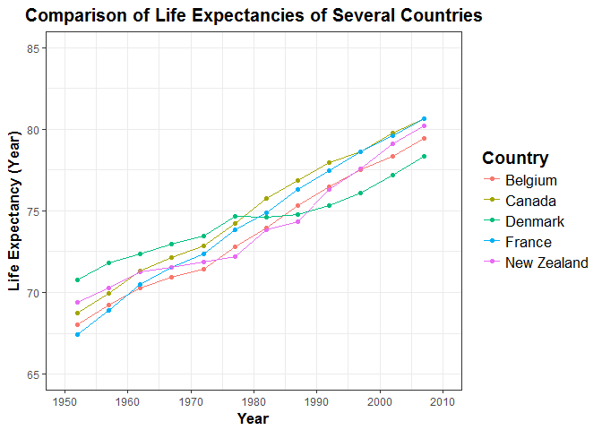

Hw 04
================

Below is homework assignment \#4.

Load the following packages:

``` r
library(gapminder)
library(tidyverse)
library(devtools)
library(knitr)
```

General data reshaping and relationship to aggregation
------------------------------------------------------

### Activity \#1

#### Make your own tidyr cheatsheet

The package `tidyr` is used to create tidy data in which each variable is in its own column and each observation is in its own row. Tidy data is particularly good for R (or similar programming languages) since the layout ensures that values of different variables from the same observation are paired (i.e. complements R's vectorized operations). It is best to organise variables by their role in the analysis with fixed variables (i.e. describe the experimental design and are known) first followed by nmeasured variables (i.e. varaibles measured in the study). The two fundamental verbs of data tidying (i.e. structuring datasets to facilitate analysis) are `gather()` and `spread()`.

See below for the format for both `gather()` and `spread()`:

##### function name &lt;- data.frame %&gt;% gather(key, value, ...)

where key is what you want to call the column headers that became a variable, value is what you want to call the stacked columns that became a variable, and `...` is the items to include (or not include) in the reshape.

The function `gather()` takes multiple columns and assembles them into key and value columns. The objective of `gather()` is to make wide data (i.e. more columns, less rows) longer. Gather columns into rows.

On the other hand, the function `spread()` takes the two columns, key and value, and spreads in to multiple columns. The objective of `spread()` is to make long data (i.e. more rows, less columns) wider. Spread rows into columns.

The function `separate` separates one column into several while the function `unite` unites several columns into one.

The package `tidyr` also provides the functions `separate()` and `extract()` which are used to pull apart a column that represents multiple variables.

#### Related packages

`tidyr` replaces `reshape2` which was used for general reshaping and `reshape` which was used for general aggregation.

| tidyr Functions | reshape2 Functions | database Functions | spreadsheet Functions |
|:---------------:|:------------------:|:------------------:|:---------------------:|
|      gather     |        melt        |        fold        |        unpivot        |
|      spread     |        cast        |       unfold       |         pivot         |

### Activity \#2

#### Make a tibble with one row per year and columns for life expectancy for two or more countries.

For this activity I will compare the life expectancy of Canada, New Zealand, France, Belgium, and Denmark. First, select data for only those countries using the function `filter()` and then use the function `select()` to retain only the columns for country, year, and life expectancy.

``` r
data.long <- gapminder %>%
  filter(country %in% c("Canada", "New Zealand", "France", "Belgium", "Denmark")) %>%
  select(country, year, lifeExp)

knitr::kable(data.long, digits = 2, align = "c", col.names = c('Country', 'Year', 'Life Expectancy (Year)'), format = 'markdown')
```

|   Country   | Year | Life Expectancy (Year) |
|:-----------:|:----:|:----------------------:|
|   Belgium   | 1952 |          68.00         |
|   Belgium   | 1957 |          69.24         |
|   Belgium   | 1962 |          70.25         |
|   Belgium   | 1967 |          70.94         |
|   Belgium   | 1972 |          71.44         |
|   Belgium   | 1977 |          72.80         |
|   Belgium   | 1982 |          73.93         |
|   Belgium   | 1987 |          75.35         |
|   Belgium   | 1992 |          76.46         |
|   Belgium   | 1997 |          77.53         |
|   Belgium   | 2002 |          78.32         |
|   Belgium   | 2007 |          79.44         |
|    Canada   | 1952 |          68.75         |
|    Canada   | 1957 |          69.96         |
|    Canada   | 1962 |          71.30         |
|    Canada   | 1967 |          72.13         |
|    Canada   | 1972 |          72.88         |
|    Canada   | 1977 |          74.21         |
|    Canada   | 1982 |          75.76         |
|    Canada   | 1987 |          76.86         |
|    Canada   | 1992 |          77.95         |
|    Canada   | 1997 |          78.61         |
|    Canada   | 2002 |          79.77         |
|    Canada   | 2007 |          80.65         |
|   Denmark   | 1952 |          70.78         |
|   Denmark   | 1957 |          71.81         |
|   Denmark   | 1962 |          72.35         |
|   Denmark   | 1967 |          72.96         |
|   Denmark   | 1972 |          73.47         |
|   Denmark   | 1977 |          74.69         |
|   Denmark   | 1982 |          74.63         |
|   Denmark   | 1987 |          74.80         |
|   Denmark   | 1992 |          75.33         |
|   Denmark   | 1997 |          76.11         |
|   Denmark   | 2002 |          77.18         |
|   Denmark   | 2007 |          78.33         |
|    France   | 1952 |          67.41         |
|    France   | 1957 |          68.93         |
|    France   | 1962 |          70.51         |
|    France   | 1967 |          71.55         |
|    France   | 1972 |          72.38         |
|    France   | 1977 |          73.83         |
|    France   | 1982 |          74.89         |
|    France   | 1987 |          76.34         |
|    France   | 1992 |          77.46         |
|    France   | 1997 |          78.64         |
|    France   | 2002 |          79.59         |
|    France   | 2007 |          80.66         |
| New Zealand | 1952 |          69.39         |
| New Zealand | 1957 |          70.26         |
| New Zealand | 1962 |          71.24         |
| New Zealand | 1967 |          71.52         |
| New Zealand | 1972 |          71.89         |
| New Zealand | 1977 |          72.22         |
| New Zealand | 1982 |          73.84         |
| New Zealand | 1987 |          74.32         |
| New Zealand | 1992 |          76.33         |
| New Zealand | 1997 |          77.55         |
| New Zealand | 2002 |          79.11         |
| New Zealand | 2007 |          80.20         |

I will now reshape the data using the function `spread()` which will convert a key-value pair across multiple columns making the data wider. `spread()` is particularly helpful for tidying the data in the country column because the five possible values (Canada, New Zealand, France, Belgium, and Denmark) can now be spread into new columns in the reshaped dataframe.

``` r
data_wide <- data.long %>%
  spread(country, lifeExp)

knitr::kable(data_wide, digits = 2, align = 'c', col.names = c('Year', 'Life Expectancy in Belgium (Year)', 'Life Expectancy in Canada (Year)', 'Life Expectancy in Denmark (Year)', 'Life Expectancy in France (Year)', 'Life Expectancy in New Zealand (Year)'), format = 'markdown')
```

<table>
<colgroup>
<col width="3%" />
<col width="19%" />
<col width="18%" />
<col width="19%" />
<col width="18%" />
<col width="21%" />
</colgroup>
<thead>
<tr class="header">
<th align="center">Year</th>
<th align="center">Life Expectancy in Belgium (Year)</th>
<th align="center">Life Expectancy in Canada (Year)</th>
<th align="center">Life Expectancy in Denmark (Year)</th>
<th align="center">Life Expectancy in France (Year)</th>
<th align="center">Life Expectancy in New Zealand (Year)</th>
</tr>
</thead>
<tbody>
<tr class="odd">
<td align="center">1952</td>
<td align="center">68.00</td>
<td align="center">68.75</td>
<td align="center">70.78</td>
<td align="center">67.41</td>
<td align="center">69.39</td>
</tr>
<tr class="even">
<td align="center">1957</td>
<td align="center">69.24</td>
<td align="center">69.96</td>
<td align="center">71.81</td>
<td align="center">68.93</td>
<td align="center">70.26</td>
</tr>
<tr class="odd">
<td align="center">1962</td>
<td align="center">70.25</td>
<td align="center">71.30</td>
<td align="center">72.35</td>
<td align="center">70.51</td>
<td align="center">71.24</td>
</tr>
<tr class="even">
<td align="center">1967</td>
<td align="center">70.94</td>
<td align="center">72.13</td>
<td align="center">72.96</td>
<td align="center">71.55</td>
<td align="center">71.52</td>
</tr>
<tr class="odd">
<td align="center">1972</td>
<td align="center">71.44</td>
<td align="center">72.88</td>
<td align="center">73.47</td>
<td align="center">72.38</td>
<td align="center">71.89</td>
</tr>
<tr class="even">
<td align="center">1977</td>
<td align="center">72.80</td>
<td align="center">74.21</td>
<td align="center">74.69</td>
<td align="center">73.83</td>
<td align="center">72.22</td>
</tr>
<tr class="odd">
<td align="center">1982</td>
<td align="center">73.93</td>
<td align="center">75.76</td>
<td align="center">74.63</td>
<td align="center">74.89</td>
<td align="center">73.84</td>
</tr>
<tr class="even">
<td align="center">1987</td>
<td align="center">75.35</td>
<td align="center">76.86</td>
<td align="center">74.80</td>
<td align="center">76.34</td>
<td align="center">74.32</td>
</tr>
<tr class="odd">
<td align="center">1992</td>
<td align="center">76.46</td>
<td align="center">77.95</td>
<td align="center">75.33</td>
<td align="center">77.46</td>
<td align="center">76.33</td>
</tr>
<tr class="even">
<td align="center">1997</td>
<td align="center">77.53</td>
<td align="center">78.61</td>
<td align="center">76.11</td>
<td align="center">78.64</td>
<td align="center">77.55</td>
</tr>
<tr class="odd">
<td align="center">2002</td>
<td align="center">78.32</td>
<td align="center">79.77</td>
<td align="center">77.18</td>
<td align="center">79.59</td>
<td align="center">79.11</td>
</tr>
<tr class="even">
<td align="center">2007</td>
<td align="center">79.44</td>
<td align="center">80.65</td>
<td align="center">78.33</td>
<td align="center">80.66</td>
<td align="center">80.20</td>
</tr>
</tbody>
</table>

This form is tidy since there is one variable in each column and each row represents one year. For creating the graph I will use the long form (i.e. data\_long) of the data since that works best with ggplot.

``` r
ggplot(data.long,aes(x = year, y = lifeExp, colour = country)) +
  geom_point() +
  geom_line() +
  scale_colour_discrete("Country") +
  scale_x_continuous("Year", breaks = seq(1950, 2010, 10),
                     labels = as.character(seq(1950, 2010, 10)),
                     limits = c(1950, 2010)) +
  scale_y_continuous(breaks = seq(65, 85, 5),
                     labels = as.character(seq(65, 85, 5)),
                     limits = c(65, 85)) +
  theme_bw() +
  theme(axis.title = element_text(size=14, face="bold"),
        plot.title = element_text(size=15, face="bold", hjust=0.48),
        axis.title.x = element_text(size=13),
        axis.title.y = element_text(size=13),
        legend.title = element_text(size=14, face="bold"),
        legend.text = element_text(size=13)) +
  labs(x = "Year", y = "Life Expectancy (Year)", title = "Comparison of Life Expectancies of Several Countries")
```



Join, merge, look up
--------------------

Dataset 'a':

|  x1 |  x2 |
|:---:|:---:|
|  A  |  3  |
|  B  |  4  |
|  C  |  5  |

Dataset 'b':

|  x1 |  x3 |
|:---:|:---:|
|  A  |  G  |
|  B  |  H  |
|  D  |  I  |

#### Mutating Joins

left\_join(a, b, by = "x1") Join matching rows from 'b' to 'a'.

|  x1 |  x2 |  x3 |
|:---:|:---:|:---:|
|  A  |  3  |  G  |
|  B  |  4  |  H  |
|  C  |  5  | N/A |

right\_join(a, b, by = "x1") Join matching rows from 'a' to 'b'.

|  x1 |  x3 |  x2 |
|:---:|:---:|:---:|
|  A  |  G  |  3  |
|  B  |  H  |  4  |
|  D  |  I  | N/A |

inner\_join(a, b, by = "x1") Join data, retain only rows in both sets.

|  x1 |  x2 |  x3 |
|:---:|:---:|:---:|
|  A  |  3  |  G  |
|  B  |  4  |  H  |

full\_join(a, b, by = "x1") Join data, retain all values and all rows.

|  x1 |  x2 |  x3 |
|:---:|:---:|:---:|
|  A  |  3  |  G  |
|  B  |  4  |  H  |
|  C  |  5  | N/A |
|  D  | N/A |  I  |

#### Filtering Joins

semi\_join(a, b, by = "x1") All rows in 'a' that have a match in 'b'.

|  x1 |  x2 |
|:---:|:---:|
|  A  |  3  |
|  B  |  4  |

anti\_join(a, b, by = "x1") All rows in 'a' that do not have a match in 'b'.

|  x1 |  x2 |
|:---:|:---:|
|  C  |  5  |

### Activity \#2

#### Make a tibble with one row per year and columns for life expectancy for two or more countries.
