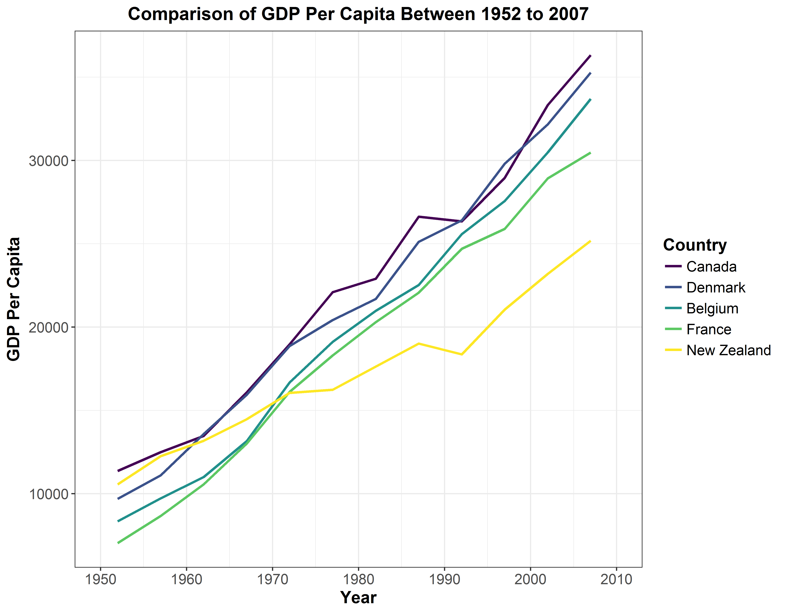
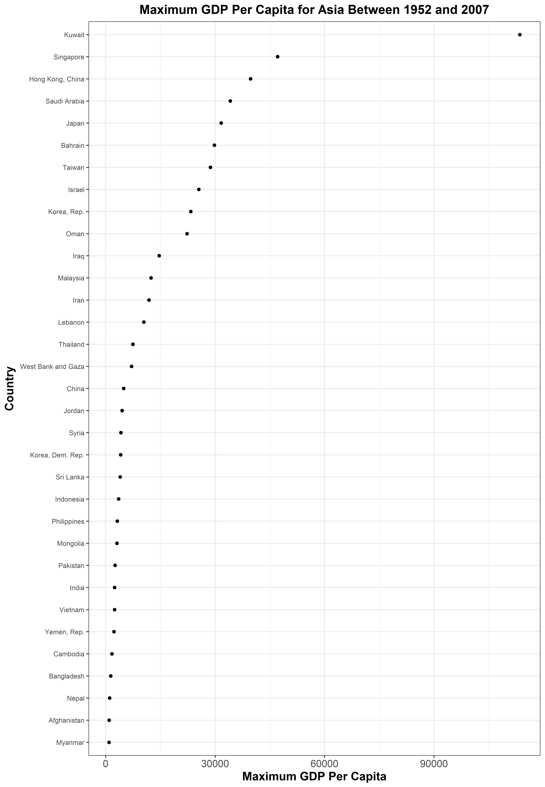

[Return to Homework 5 Folder](https://github.com/heathersummers/STAT545-hw-Summers-Heather/tree/master/hw05)

[Return to Main Page of Repository](https://github.com/heathersummers/STAT545-hw-Summers-Heather)


## Table of Contents:

[Factor management](#factor-management)

  - [Drop Oceania](#drop-oceania)
  - [Reorder the levels of country or continent](#reorder-the-levels-of-country-or-continent)

    - [Effects of arrange](#effect-of-arrange)
    - [Effects of factor reordering](#effects-of-factor-reordering)
    - [Effects of factor reordering coupled with arrange](#effects-of-factor-reordering-coupled-with-arrange)
    
[File](#file)

[Visualization design](#visualization-design)

[Writing figures to file](#writing-figures-to-file)

[But I want to do more](#but-i-want-to-do-more)


Load the following packages:
```{r results='hide', message=FALSE, warning=FALSE}
library(gapminder)
library(tidyverse)
library(forcats)
library(devtools)
library(knitr)
library(RColorBrewer)
library(viridis)
```

## Factor management
### Gapminder version:
#### Drop Oceania

<a href="#top">Back to top</a>

In order to remove all the entries associated with Oceania I used the function `filter()`.
```{r}
gap.no.oceania <- gapminder %>%
  filter(continent != "Oceania")
table(gap.no.oceania$continent)
```
The `filter` function was able to remove the entries associated with the continent Oceania, however the level Oceania is still present in the table. Thus, in my next attempt I used the function `factor`.
```{r}
gap.drop.oceania <- factor(gap.no.oceania$continent)

table(gap.drop.oceania)
```
The function `factor` was able to remove the levels for the continent Oceania.

Another function that is able to remove the level Oceania is `droplevels` as it is a base function that operates on all factors in a data frame or on a single factor.
```{r}
gap.nolevel.oceania <- droplevels(gap.no.oceania)

table(gap.nolevel.oceania$continent)
```

The function `forcats::fct_drop()` also drops the factor Oceania.
```{r}
gap.no.oceania$continent %>%
  fct_drop() %>%
  levels()
```

The functions `factor`, `droplevels`, and `forcats::fct_drop()` were able to remove all entries and the level associated with Oceania.

#### Reorder the levels of country or continent

<a href="#top">Back to top</a>

I used the maximum GDP per capita for each country over the study period (i.e. 1952 - 2007) as my summary statistic. 

##### Effects of arrange

```{r}
gap.gdpPercap.max <- gapminder %>%
  group_by(country) %>%
  summarize(continent = unique(continent),
            lifeExp.max = max(lifeExp),
            gdpPercap.max = max(gdpPercap)) %>%
  arrange(desc(gdpPercap.max))

# factor levels:
head(levels(gap.gdpPercap.max$country))

# table of the data:
knitr::kable(head(gap.gdpPercap.max),
                  col.names = c('Country','Continent','Life Expectancy(Years)','GDP Per Capita'),
                  digits = 3,
                  align ='c',
                  format = 'html',
                  caption = "Maximum Life Expectancy and GDP Per Capita Between 1952 and 2007")

# figure of the data for just Asia:
gap_asia_gdpPercap.max <- gap.gdpPercap.max %>%
  filter(continent == "Asia") %>%
  ggplot(aes(x = gdpPercap.max, y = country)) +
  geom_point() +
  scale_x_continuous("Maximum GDP Per Capita") +
  labs(title = "Maximum GDP Per Capita for Asia Between 1952 and 2007", y = "Country") +
  theme_bw() +
  theme(axis.title = element_text(size=14, face="bold"),
        axis.text.x = element_text(size=12),
        axis.text.y = element_text(size=8),
        plot.title = element_text(size=15, face="bold", hjust = 0.5))
gap_asia_gdpPercap.max
```

As you can see above, using the `arrange()` function does not change the country factor levels as they are still in alphabetical order (i.e. the default). In the figure above the countries are aligned in alphabetical order rather than being ordered based on the quantitative variable of maximum GDP per capita and thus the points on the graph are scattered everywhere with no evident pattern. Thus, only arranging the data based on maximum GDP per capita had no effect on the figure.

##### Effects of factor reordering

<a href="#top">Back to top</a>

Now I must reorder the country factor levels according to the maximum GDP per capita summary.
```{r}
gap.gdpPercap.max_factor <- gap.gdpPercap.max %>%
  mutate(country = fct_reorder(country, gdpPercap.max)) %>%
  select(country, continent, gdpPercap.max)

#factors levels:
head(levels(gap.gdpPercap.max_factor$country))

#table of the data:
knitr::kable(head(gap.gdpPercap.max_factor),
                  col.names = c('Country','Continent','GDP Per Capita'),
                  digits = 3,
                  align ='c',
                  format = 'html',
                  caption = "Maximum GDP Per Capita Between 1952 and 2007 Using Ordered Country Factor Levels") 

#figure of the data for just Asia:
gap_asia_gdpPercap.max_factor <- gap.gdpPercap.max_factor %>%
  filter(continent == "Asia") %>%
  ggplot(aes(x = gdpPercap.max, y = country)) +
  geom_point() +
  scale_x_continuous("Maximum GDP Per Capita") +
  labs(title = "Maximum GDP Per Capita for Asia Between 1952 and 2007", y = "Country") +
  theme_bw() +
  theme(axis.title = element_text(size=14, face="bold"),
        axis.text.x = element_text(size=12),
        axis.text.y = element_text(size=8),
        plot.title = element_text(size=15, face="bold", hjust = 0.5))
gap_asia_gdpPercap.max_factor
```

As you can see above, reordering a factor  by a quantitative variable such as maximum GDP per capita arranges the data in a figure so that the points illustrate a clear pattern since the countries are listed on the y-axis in order of their maximum GDP per capita and not alphabetical order. The `country` variable has been ordered according to maximum GDP per capita between 1952 and 2007. The reorder country factor level made it easier to interpret the figure and determine which country has the lowest and highest maximum GDP per capita over the study period.

Below is another way to reorder the country factor levels according to descending maximum GDP per capita.
```{r}
#order according to decreasing maximum GDP per capita
fct_reorder(gapminder$country, gapminder$gdpPercap, max, .desc = TRUE) %>%
  levels() %>%
  head()
```

##### Effects of factor reordering coupled with arrange

<a href="#top">Back to top</a>

Now I will investigate the effects of factor reordering coupled with `arrange()` to see what effects it might have on a figure.
```{r}
gap.gdpPercap.max_factor_arrange <- gap.gdpPercap.max_factor %>%
  arrange(desc(gdpPercap.max))

#factor levels:
head(levels(gap.gdpPercap.max_factor_arrange$country))

#table of the data:
knitr::kable(head(gap.gdpPercap.max_factor_arrange),
                  col.names = c('Country','Continent','GDP Per Capita'),
                  digits = 3,
                  align ='c',
                  format = 'html',
                  caption = "Maximum GDP Per Capita Between 1952 and 2007 Using Arranged and Ordered Country Factor Levels") 

#figure of the data for just Asia:
gap_asia_gdpPercap.max_factor_arrange <- gap.gdpPercap.max_factor_arrange %>%
  filter(continent == "Asia") %>%
  ggplot(aes(x = gdpPercap.max, y = country)) +
  geom_point() +
  scale_x_continuous("Maximum GDP Per Capita") +
  labs(title = "Maximum GDP Per Capita for Asia Between 1952 and 2007", y = "Country") +
  theme_bw() +
  theme(axis.title = element_text(size=14, face="bold"),
        axis.text.x = element_text(size=12),
        axis.text.y = element_text(size=8),
        plot.title = element_text(size=15, face="bold", hjust = 0.5))
gap_asia_gdpPercap.max_factor_arrange
```

As expected, there is no change in the country factor levels or graph to the situation above when there was only factor reordering.

## File

<a href="#top">Back to top</a>

There are three different ways to save a file and then re-import it: `saveRDS()/readRDS()`, `write_csv()/read_csv()`, and `dput()/dget()`. I will first save and then import the file back in using the functions `saveRDS()/readRDS()`.

First I will save the modified data with the reordered country factor levels (gap.gdpPercap.max_factor) according to ascending maximum GDP per capita.
```{r}
save_rds <- tempfile("gap.gdpPercap.max_factor", fileext = ".rds")
saveRDS(gap.gdpPercap.max_factor,save_rds)
```

Now I will re-import the data back in.
```{r}
reload_data_rds <- readRDS(save_rds)
str(reload_data_rds)
head(levels(reload_data_rds$country))
```
As you can see the reordering country factor levels have been restored using the `saveRDS()`/`readRDS()` functions.

Next, I will save and import the modified data back in using the functions `write_csv()/read_csv()`.
```{r}
save_csv <- tempfile("gap.gdpPercap.max_factor", fileext = ".csv")
write_csv(gap.gdpPercap.max_factor,save_csv)
```

Now I will re-import the data back in using the function `read_csv()` but will also include column specifications in order to avoid warning messages.

```{r}
columns <- cols(
  country = col_character(),
  continent = col_character(),
  gdpPercap.max = col_double()
)

reload_data_csv <- read_csv(save_csv, col_types = columns)
str(reload_data_csv$country)
```
As you can see, the functions `write_csv()/read_csv()` do not restore the structure of the country factor levels.

Lastly, I will save the modified data file using the functions `dput()/dget()`.
First I sill save the file using the function `dput()`.
```{r}
save_txt <- tempfile("gap.gdpPercap.max_factor", fileext = ".txt")
dput(gap.gdpPercap.max_factor,save_txt)
```

Now I will re-import the data using the function `dget()`.
```{r}
reload_data_txt <- dget(save_txt)
str(reload_data_txt)
head(levels(reload_data_txt$country))
```
As you can see the functions `dput()/dget()` restore the structure of the country factor levels.

I created a new tibble in order to show how the factor levels of the original data with factor reordering by maximum GDP per capita compared to the reloaded data saved either by `rds`, `csv`, or `txt`.
```{r}
countrylevel <- tibble(original = head(levels(fct_reorder(gap.gdpPercap.max$country,gap.gdpPercap.max$gdpPercap.max))))

reload_data_rds <- reload_data_rds %>%
  mutate(country = factor(country))
reload_data_csv <- reload_data_csv %>%
  mutate(country = factor(country))
reload_data_txt <- reload_data_txt %>% 
  mutate(country = factor(country))

knitr::kable(countrylevel %>%
               mutate(via_rds = head(levels(reload_data_rds$country)),
                      via_csv = head(levels(reload_data_csv$country)),
                      via_txt = head(levels(reload_data_txt$country))),
             col.names = c('Original Factored Data','Save Via rds','Save Via csv','Save Via txt'),
             align ='c',
             format = 'html',
             caption = "Factor Levels of the Original Data Compared to the Reloaded Data")
```
As you can see from the table above the functions `write_csv()/read_csv()` did not save the structure of the factor levels (i.e. reverted back to alphabetical ordering) when the data was reloaded whereas the functions `saveRDS()/readRDS()` and `dput()/dget()` retained the factor levels upon re-importing the data back into the document.

## Visualization design

<a href="#top">Back to top</a>

I have decided to re-make some of the plots I created in homework #2 of GDP per capita per year for five countries.
```{r}
gdp_countries <- c("Canada", "New Zealand","France", "Belgium", "Denmark")
gapminder_gdp <- gapminder %>%
  filter(country %in% gdp_countries) %>%
  droplevels() %>%
  ggplot(aes(x = year, 
             y = gdpPercap, 
             colour = fct_reorder2(country, year, gdpPercap))) + 
  geom_line(size=1) + 
  scale_x_continuous("Year", breaks = seq(1950, 2010, 10),
                     labels = as.character(seq(1950, 2010, 10)),
                     limits = c(1950, 2010)) +
  scale_y_continuous("GDP Per Capita") +
  scale_colour_viridis(discrete=TRUE) +
  theme_bw() +
  theme(axis.title = element_text(size=14, face="bold"),
        axis.text.x = element_text(size=12),
        axis.text.y = element_text(size=12),
        plot.title = element_text(size=15, face="bold", hjust = 0.5),
        legend.title = element_text(size=14, face="bold"),
        legend.text = element_text(size=12)) +
  labs(title = "Comparison of GDP Per Capita Between 1952 to 2007", 
       colour = "Country")
print(gapminder_gdp)
```

I used the color scales in the package `viridis` to colour-code the countries since the colours are easier to read by those with colourblindness. I also used the function `fct_reorder2()` so that for my factor colour the legend appears in the same order as the data.


This next figure I decided to create based on several different figures I have created for past homework assignments. I used factor reordering of life expectancy range for countries in teh Americas and colour-coded the points on the scatter plot according to the average GDP per capita of each country.
```{r results='hide', message=FALSE, warning=FALSE}
gap_Americas_lifeExprange <- gapminder %>%
  filter(continent == "Americas") %>% 
  group_by(country) %>%
  summarize(lifeExp.range = max(lifeExp) - min(lifeExp),
            gdp.mean = mean(gdpPercap))

gap_Americas_lifeExprange_factor <- gap_Americas_lifeExprange %>%
  mutate(country = fct_reorder(country, lifeExp.range)) %>%
  select(country, lifeExp.range, gdp.mean)

ggplot(gap_Americas_lifeExprange_factor, aes(country, lifeExp.range, colour = gdp.mean)) +
  geom_point(size = 2.5) +
  scale_x_discrete("Country") +
  scale_y_continuous("Life Expectancy\nRange (Years)") +
  scale_colour_distiller("Average GDP Per Capita", palette="Spectral", direction = 1) + #direction = 1 refers to the direction of the colour scale
  labs(title = "Life Expectancy Range of Countries\nin the Americas Between 1952 to 2007", x = "Country") +
  theme_bw() +
  theme(axis.title = element_text(size=12, face="bold"),
        axis.text.x = element_text(size=9, angle = 90), #rotate the axis labels 90 degrees
        axis.text.y = element_text(size=11),
        plot.title = element_text(size=14, face="bold", hjust = 0.5),
        legend.title = element_text(size=13, face="bold"),
        legend.text = element_text(size=12))
```

In the figure above I used country factor level reordering by the life expectancy range in order to have the countries in the Americas arranged in order of life expectancy range. I also used the `Spectral` palette in the `RColorBrewer` package.


## Writing figures to file

<a href="#top">Back to top</a>

Below I have saved the figure above of GDP per capita per year using the function `ggsave()`. It is best to explicitly tell `ggsave` which plot object or else the order of the arguments will be the only way that `ggsave` will be able to interpret the inputs.
```{r}
ggsave("gdp_vs_year.png",
       plot = gapminder_gdp,
       device = "png",
       width = 9,
       height = 7,
       dpi = 500) #resolution

ggsave("gdp_vs_year.pdf",
       plot = gapminder_gdp,
       device = "pdf",
       width = 11,
       height = 8,
       dpi = 400)
```

To insert the saved figure back into the page use the code ``.



The `pdf` image cannot be inserted into the markdown file but can be found at this [link](gdp_vs_year.pdf).

I also saved the figure of the reordered country factor levels of maximum GDP per capita in Asia between 1952 to 2007.
```{r}
ggsave("maxgdp_vs_Asiancountries.png",
       plot = gap_asia_gdpPercap.max_factor,
       device = "png",
       width = 9,
       height = 13,
       dpi = 500)
```


## But I want to do more

<a href="#top">Back to top</a>

I decided to explore more of the `forcats` package and created a file with the [national animal](https://animalsake.com/list-of-national-animals-around-world) of several countries. 

```{r}
national_animal <- read.csv("national_animal.csv")
knitr::kable(national_animal,
             align = 'c',
             format = 'html',
             caption = "National Animals")

#match the country factor levels in both the gapmidner data frame and the national animal data frame
national_animal$country <- factor(national_animal$country, levels(gapminder$country))

#use `semi_join` to filter all the rows in the gapminder data frame so that only those that have a match in the national_animal data frame are retained
gapminder.animal <- semi_join(gapminder, national_animal, by = c("country"))

#add a new factor in which the country variable from the gapminder data frame is relabled to animal factor level from the national animal data frame
gapminder.animal$animal <- droplevels(gapminder.animal$country)
levels(gapminder.animal$animal) <- national_animal$animal
View(gapminder.animal)
```

<a href="#top">Back to top</a>
