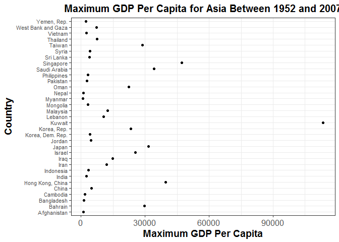

hw05
================
Heather
October 18, 2017

Table of Contents:
------------------

[Factor management](#factor_management)

-   [Drop Oceania](#drop_oceania)

-   [Reorder the levels of country or continent](#reorder_the_levels_of_country_or_continent)
    -   [Effects of `arrange()`](#effect_of_arrange())
    -   [Effects of factor reordering](#effects_of_factor_reordering)
    -   [Effects of factor reordering coupled with `arrange()`](#effects_of_factor_reordering_coupled_with_arrange())

[File I/O](#file_i/o)

[Visualization design](#visualization_design)

[Writing figures to file](#writing_figures_to_file)

Load the following packages:

``` r
library(gapminder)
library(tidyverse)
library(forcats)
library(devtools)
library(knitr)
library(RColorBrewer)
library(viridis)
```

Factor management
-----------------

### Gapminder version:

#### Drop Oceania

<a href="#top">Back to top</a>

In order to remove all the entries associated with Oceania I used the function `filter()`.

``` r
gap.no.oceania <- gapminder %>%
  filter(continent != "Oceania")
table(gap.no.oceania$continent)
```

    ## 
    ##   Africa Americas     Asia   Europe  Oceania 
    ##      624      300      396      360        0

The `filter` function was able to remove the entries associated with the continent Oceania, however the level Oceania is still present in the table. Thus, in my next attempt I used the function `factor`.

``` r
gap.drop.oceania <- factor(gap.no.oceania$continent)

table(gap.drop.oceania)
```

    ## gap.drop.oceania
    ##   Africa Americas     Asia   Europe 
    ##      624      300      396      360

The function `factor` was able to remove the levels for the continent Oceania.

Another function that is able to remove the level Oceania is `droplevels` as it is a base function that operates on all factors in a data frame or on a single factor.

``` r
gap.nolevel.oceania <- droplevels(gap.no.oceania)

table(gap.nolevel.oceania$continent)
```

    ## 
    ##   Africa Americas     Asia   Europe 
    ##      624      300      396      360

The function `forcats::fct_drop()` also drops the factor Oceania.

``` r
gap.no.oceania$continent %>%
  fct_drop() %>%
  levels()
```

    ## [1] "Africa"   "Americas" "Asia"     "Europe"

The functions `factor`, `droplevels`, and `forcats::fct_drop()` were able to remove all entries and the level associated with Oceania.

#### Reorder the levels of country or continent

<a href="#top">Back to top</a>

I used the maximum GDP per capita for each country over the study period (i.e. 1952 - 2007) as my summary statistic.

##### Effects of `arrange()`

``` r
gap.gdpPercap.max <- gapminder %>%
  group_by(country) %>%
  summarize(continent = unique(continent),
            lifeExp.max = max(lifeExp),
            gdpPercap.max = max(gdpPercap)) %>%
  arrange(desc(gdpPercap.max))

#factor levels:
head(levels(gap.gdpPercap.max$country))
```

    ## [1] "Afghanistan" "Albania"     "Algeria"     "Angola"      "Argentina"  
    ## [6] "Australia"

``` r
#table of the data:
knitr::kable(head(gap.gdpPercap.max),
                  col.names = c('Country','Continent','Life Expectancy(Years)','GDP Per Capita'),
                  digits = 3,
                  align ='c',
                  format = 'html',
                  caption = "Maximum Life Expectancy and GDP Per Capita Between 1952 and 2007")
```

<table>
<caption>
Maximum Life Expectancy and GDP Per Capita Between 1952 and 2007
</caption>
<thead>
<tr>
<th style="text-align:center;">
Country
</th>
<th style="text-align:center;">
Continent
</th>
<th style="text-align:center;">
Life Expectancy(Years)
</th>
<th style="text-align:center;">
GDP Per Capita
</th>
</tr>
</thead>
<tbody>
<tr>
<td style="text-align:center;">
Kuwait
</td>
<td style="text-align:center;">
Asia
</td>
<td style="text-align:center;">
77.588
</td>
<td style="text-align:center;">
113523.13
</td>
</tr>
<tr>
<td style="text-align:center;">
Norway
</td>
<td style="text-align:center;">
Europe
</td>
<td style="text-align:center;">
80.196
</td>
<td style="text-align:center;">
49357.19
</td>
</tr>
<tr>
<td style="text-align:center;">
Singapore
</td>
<td style="text-align:center;">
Asia
</td>
<td style="text-align:center;">
79.972
</td>
<td style="text-align:center;">
47143.18
</td>
</tr>
<tr>
<td style="text-align:center;">
United States
</td>
<td style="text-align:center;">
Americas
</td>
<td style="text-align:center;">
78.242
</td>
<td style="text-align:center;">
42951.65
</td>
</tr>
<tr>
<td style="text-align:center;">
Ireland
</td>
<td style="text-align:center;">
Europe
</td>
<td style="text-align:center;">
78.885
</td>
<td style="text-align:center;">
40676.00
</td>
</tr>
<tr>
<td style="text-align:center;">
Hong Kong, China
</td>
<td style="text-align:center;">
Asia
</td>
<td style="text-align:center;">
82.208
</td>
<td style="text-align:center;">
39724.98
</td>
</tr>
</tbody>
</table>
``` r
#figure of the data for just Asia:
gap_asia_gdpPercap.max <- gap.gdpPercap.max %>%
  filter(continent == "Asia") %>%
  ggplot(aes(x = gdpPercap.max, y = country)) +
  geom_point() +
  scale_x_continuous("Maximum GDP Per Capita") +
  labs(title = "Maximum GDP Per Capita for Asia Between 1952 and 2007", y = "Country") +
  theme_bw() +
  theme(axis.title = element_text(size=14, face="bold"),
        axis.text.x = element_text(size=12),
        axis.text.y = element_text(size=8),
        plot.title = element_text(size=15, face="bold", hjust = 0.5))
gap_asia_gdpPercap.max
```



As you can see above, using the `arrange()` function does not change the country factor levels as they are still in alphabetical order (i.e. the default). In the figure above the countries are aligned in alphabetical order rather than being ordered based on the quantitative variable of maximum GDP per capita and thus the points on the graph are scattered everywhere with no evident pattern. Thus, only arranging the data based on maximum GDP per capita had no effect on the figure.

##### Effects of factor reordering

<a href="#top">Back to top</a>

Now I must reorder the country factor levels according to the maximum GDP per capita summary.

``` r
gap.gdpPercap.max_factor <- gap.gdpPercap.max %>%
  mutate(country = fct_reorder(country, gdpPercap.max)) %>%
  select(country, continent, gdpPercap.max)

#factors levels:
head(levels(gap.gdpPercap.max_factor$country))
```

    ## [1] "Burundi"    "Ethiopia"   "Malawi"     "Zimbabwe"   "Liberia"   
    ## [6] "Mozambique"

``` r
#table of the data:
knitr::kable(head(gap.gdpPercap.max_factor),
                  col.names = c('Country','Continent','GDP Per Capita'),
                  digits = 3,
                  align ='c',
                  format = 'html',
                  caption = "Maximum GDP Per Capita Between 1952 and 2007 Using Ordered Country Factor Levels") 
```

<table>
<caption>
Maximum GDP Per Capita Between 1952 and 2007 Using Ordered Country Factor Levels
</caption>
<thead>
<tr>
<th style="text-align:center;">
Country
</th>
<th style="text-align:center;">
Continent
</th>
<th style="text-align:center;">
GDP Per Capita
</th>
</tr>
</thead>
<tbody>
<tr>
<td style="text-align:center;">
Kuwait
</td>
<td style="text-align:center;">
Asia
</td>
<td style="text-align:center;">
113523.13
</td>
</tr>
<tr>
<td style="text-align:center;">
Norway
</td>
<td style="text-align:center;">
Europe
</td>
<td style="text-align:center;">
49357.19
</td>
</tr>
<tr>
<td style="text-align:center;">
Singapore
</td>
<td style="text-align:center;">
Asia
</td>
<td style="text-align:center;">
47143.18
</td>
</tr>
<tr>
<td style="text-align:center;">
United States
</td>
<td style="text-align:center;">
Americas
</td>
<td style="text-align:center;">
42951.65
</td>
</tr>
<tr>
<td style="text-align:center;">
Ireland
</td>
<td style="text-align:center;">
Europe
</td>
<td style="text-align:center;">
40676.00
</td>
</tr>
<tr>
<td style="text-align:center;">
Hong Kong, China
</td>
<td style="text-align:center;">
Asia
</td>
<td style="text-align:center;">
39724.98
</td>
</tr>
</tbody>
</table>
``` r
#figure of the data for just Asia:
gap_asia_gdpPercap.max_factor <- gap.gdpPercap.max_factor %>%
  filter(continent == "Asia") %>%
  ggplot(aes(x = gdpPercap.max, y = country)) +
  geom_point() +
  scale_x_continuous("Maximum GDP Per Capita") +
  labs(title = "Maximum GDP Per Capita for Asia Between 1952 and 2007", y = "Country") +
  theme_bw() +
  theme(axis.title = element_text(size=14, face="bold"),
        axis.text.x = element_text(size=12),
        axis.text.y = element_text(size=8),
        plot.title = element_text(size=15, face="bold", hjust = 0.5))
gap_asia_gdpPercap.max_factor
```


As you can see above, reordering a factor by a quantitative variable such as maximum GDP per capita arranges the data in a figure so that the points illustrate a clear pattern since the countries are listed on the y-axis in order of their maximum GDP per capita and not alphabetical order. The `country` variable has been ordered according to maximum GDP per capita between 1952 and 2007. The reorder country factor level made it easier to interpret the figure and determine which country has the lowest and highest maximum GDP per capita over the study period.

Below is another way to reorder the country factor levels according to descending maximum GDP per capita.

``` r
#order according to decreasing maximum GDP per capita
fct_reorder(gapminder$country, gapminder$gdpPercap, max, .desc = TRUE) %>%
  levels() %>%
  head()
```

    ## [1] "Kuwait"           "Norway"           "Singapore"       
    ## [4] "United States"    "Ireland"          "Hong Kong, China"

##### Effects of factor reordering coupled with `arrange()`

<a href="#top">Back to top</a>

Now I will investigate the effects of factor reordering coupled with `arrange()` to see what effects it might have on a figure.

``` r
gap.gdpPercap.max_factor_arrange <- gap.gdpPercap.max_factor %>%
  arrange(desc(gdpPercap.max))

#factor levels:
head(levels(gap.gdpPercap.max_factor_arrange$country))
```

    ## [1] "Burundi"    "Ethiopia"   "Malawi"     "Zimbabwe"   "Liberia"   
    ## [6] "Mozambique"

``` r
#table of the data:
knitr::kable(head(gap.gdpPercap.max_factor_arrange),
                  col.names = c('Country','Continent','GDP Per Capita'),
                  digits = 3,
                  align ='c',
                  format = 'html',
                  caption = "Maximum GDP Per Capita Between 1952 and 2007 Using Arranged and Ordered Country Factor Levels") 
```

<table>
<caption>
Maximum GDP Per Capita Between 1952 and 2007 Using Arranged and Ordered Country Factor Levels
</caption>
<thead>
<tr>
<th style="text-align:center;">
Country
</th>
<th style="text-align:center;">
Continent
</th>
<th style="text-align:center;">
GDP Per Capita
</th>
</tr>
</thead>
<tbody>
<tr>
<td style="text-align:center;">
Kuwait
</td>
<td style="text-align:center;">
Asia
</td>
<td style="text-align:center;">
113523.13
</td>
</tr>
<tr>
<td style="text-align:center;">
Norway
</td>
<td style="text-align:center;">
Europe
</td>
<td style="text-align:center;">
49357.19
</td>
</tr>
<tr>
<td style="text-align:center;">
Singapore
</td>
<td style="text-align:center;">
Asia
</td>
<td style="text-align:center;">
47143.18
</td>
</tr>
<tr>
<td style="text-align:center;">
United States
</td>
<td style="text-align:center;">
Americas
</td>
<td style="text-align:center;">
42951.65
</td>
</tr>
<tr>
<td style="text-align:center;">
Ireland
</td>
<td style="text-align:center;">
Europe
</td>
<td style="text-align:center;">
40676.00
</td>
</tr>
<tr>
<td style="text-align:center;">
Hong Kong, China
</td>
<td style="text-align:center;">
Asia
</td>
<td style="text-align:center;">
39724.98
</td>
</tr>
</tbody>
</table>
``` r
#figure of the data for just Asia:
gap_asia_gdpPercap.max_factor_arrange <- gap.gdpPercap.max_factor_arrange %>%
  filter(continent == "Asia") %>%
  ggplot(aes(x = gdpPercap.max, y = country)) +
  geom_point() +
  scale_x_continuous("Maximum GDP Per Capita") +
  labs(title = "Maximum GDP Per Capita for Asia Between 1952 and 2007", y = "Country") +
  theme_bw() +
  theme(axis.title = element_text(size=14, face="bold"),
        axis.text.x = element_text(size=12),
        axis.text.y = element_text(size=8),
        plot.title = element_text(size=15, face="bold", hjust = 0.5))
gap_asia_gdpPercap.max_factor_arrange
```


As expected, there is no change in the country factor levels or graph to the situation above when there was only factor reordering.

File I/O
--------

<a href="#top">Back to top</a>

There are three different ways to save a file and then re-import it: `saveRDS()/readRDS()`, `write_csv()/read_csv()`, and `dput()/dget()`. I will first save and then import the file back in using the functions `saveRDS()/readRDS()`.

First I will save the modified data with the reordered country factor levels according to ascending maximum GDP per capita.

``` r
save_rds <- tempfile("gap.gdpPercap.max", fileext = ".rds")
saveRDS(gap.gdpPercap.max,save_rds)
```

Now I will re-import the data back in.

``` r
reload_data_rds <- readRDS(save_rds)
str(reload_data_rds)
```

    ## Classes 'tbl_df', 'tbl' and 'data.frame':    142 obs. of  4 variables:
    ##  $ country      : Factor w/ 142 levels "Afghanistan",..: 72 96 114 135 63 56 124 91 21 58 ...
    ##  $ continent    : Factor w/ 5 levels "Africa","Americas",..: 3 4 3 2 4 3 4 4 2 4 ...
    ##  $ lifeExp.max  : num  77.6 80.2 80 78.2 78.9 ...
    ##  $ gdpPercap.max: num  113523 49357 47143 42952 40676 ...

As you can see the reordering country factor levels have been restored using the `saveRDS()`/`readRDS()` functions.

Next, I will save and import the modified data back in using the functions `write_csv()/read_csv()`.

``` r
save_csv <- tempfile("gap.gdpPercap.max", fileext = ".csv")
write_csv(gap.gdpPercap.max,save_csv)
```

Now I will re-import the data back in using the function `read_csv()` but will also include column specifications in order to avoid warning messages.

``` r
columns <- cols(
  country = col_character(),
  continent = col_character(),
  gdpPercap.max = col_double()
)

reload_data_csv <- read_csv(save_csv, col_types = columns)
str(reload_data_csv$country)
```

    ##  chr [1:142] "Kuwait" "Norway" "Singapore" "United States" "Ireland" ...

Lastly, I will save the modified data file using the functions `dput()/dget()`. First I sill save the file using the function `dput()`.

``` r
save_txt <- tempfile("gap.gdpPercap.max", fileext = ".txt")
dput(gap.gdpPercap.max,save_txt)
```

Now I will re-import the data using the function `dget()`.

``` r
reload_data_txt <- dget(save_txt)
str(reload_data_txt)
```

    ## Classes 'tbl_df', 'tbl' and 'data.frame':    142 obs. of  4 variables:
    ##  $ country      : Factor w/ 142 levels "Afghanistan",..: 72 96 114 135 63 56 124 91 21 58 ...
    ##  $ continent    : Factor w/ 5 levels "Africa","Americas",..: 3 4 3 2 4 3 4 4 2 4 ...
    ##  $ lifeExp.max  : num  77.6 80.2 80 78.2 78.9 ...
    ##  $ gdpPercap.max: num  113523 49357 47143 42952 40676 ...

As you can see the functions `dput()/dget()` restore the structure of the country factor levels.

Visualization design
--------------------

<a href="#top">Back to top</a>

I have decided to re-make some of the plots I created in homework \#2 of GDP per capita per year for five countries.

``` r
gdp_countries <- c("Canada", "New Zealand","France", "Belgium", "Denmark")
gapminder_gdp <- gapminder %>%
  filter(country %in% gdp_countries) %>%
  droplevels() %>%
  ggplot(aes(x = year, 
             y = gdpPercap, 
             colour = fct_reorder2(country, year, gdpPercap))) + 
  geom_line(size=1) + 
  scale_x_continuous("Year", breaks = seq(1950, 2010, 10),
                     labels = as.character(seq(1950, 2010, 10)),
                     limits = c(1950, 2010)) +
  scale_y_continuous("GDP Per Capita") +
  scale_colour_viridis(discrete=TRUE) +
  theme_bw() +
  theme(axis.title = element_text(size=14, face="bold"),
        axis.text.x = element_text(size=12),
        axis.text.y = element_text(size=12),
        plot.title = element_text(size=15, face="bold", hjust = 0.5),
        legend.title = element_text(size=14, face="bold"),
        legend.text = element_text(size=12)) +
  labs(title = "Comparison of GDP Per Capita Between 1952 to 2007", 
       colour = "Country")
print(gapminder_gdp)
```


I used the color scales in the package `viridis` to colour-code the countries since the colours are easier to read by those with colourblindness. I also used the function `fct_reorder2()` so that for my factor colour the legend appears in the same order as the data.

Writing figure to file
----------------------

<a href="#top">Back to top</a>

Below I have saved the figure above using the function `ggsave()`. It is best to explicitly tell `ggsave` which plot object or else the order of the arguments will be the only way that `ggsave` will be able to interpret the inputs.

``` r
ggsave("gdp_vs_year.png",
       plot = gapminder_gdp,
       device = "png",
       width = 9,
       height = 7,
       dpi = 500)

ggsave("gdp_vs_year.pdf",
       plot = gapminder_gdp,
       device = "pdf",
       width = 11,
       height = 8,
       dpi = 400)
```

To insert the saved figure back into the page use the code ``.


The `pdf` image cannot be inserted into the markdown file but can be found at this [link](gdp_vs_year.pdf).
